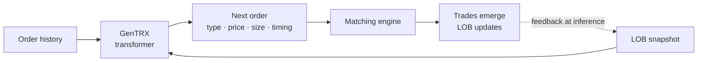
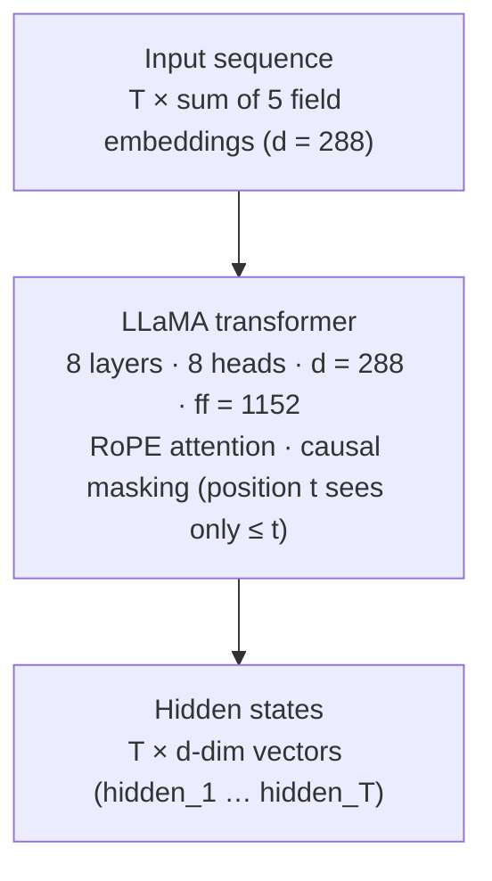
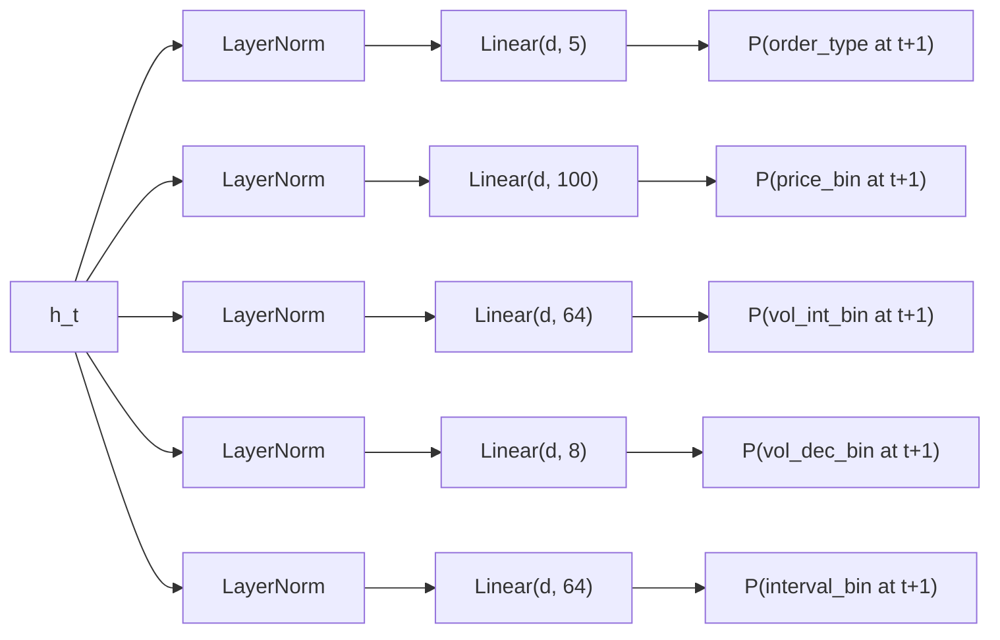
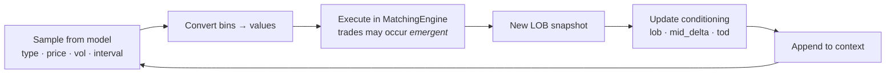
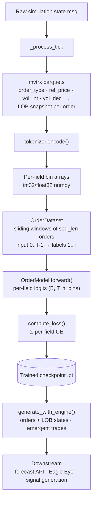

# GenTRX - Model Architecture

## What It Does

GenTRX is an autoregressive generative model for financial order book activity. Given a history of orders and the current state of the limit order book, it predicts the next order that will arrive at the exchange.

Orders are the atomic input. Trades are **not** modeled directly - they **emerge** when generated orders are executed through a matching engine. This means the model learns the microstructure mechanics (who places what, when, and where) and realistic price dynamics fall out as a consequence.



## Input: What Goes In

Each position in the sequence is one order event. An order is decomposed into 8 fields, split into two categories:

### Predicted fields (the model learns to generate these)

| Field | Type | Bins | Range | Meaning |
|-------|------|------|-------|---------|
| `order_type` | categorical | 5 | {Bid, Ask, Cancel, Exec buy, Exec sell} | What kind of order |
| `price` | binned int | 100 | symmetric log [-500, +500] ticks | Price relative to current mid |
| `vol_int` | binned int | 64 | log-scale [0, 10000] | Integer part of quantity |
| `vol_dec` | binned float | 8 | [0.0, 1.0) | Fractional part of quantity |
| `interval` | binned int | 64 | log-scale [0, 60s] in nanoseconds | Time since previous order |

### Conditioning fields (observed context, not predicted)

| Field | Type | Dim | Meaning |
|-------|------|-----|---------|
| `lob_volumes` | float vector | 20 | Top 10 ask + 10 bid volume levels |
| `time_of_day` | continuous | - | Second of day (FiLM-conditioned, not embedded) |
| `mid_delta` | continuous | - | Mid price change from session open (additive) |

The 5 predicted fields are independently embedded to dimension `d` and **summed** into a single vector per position. This is the input to the transformer.

Conditioning is injected via **FiLM** (Feature-wise Linear Modulation): at layers 2, 5, and 7, the LOB volumes and time-of-day produce per-channel scale and shift parameters that modulate the hidden state. Mid-price delta is added directly.

### Why decomposed (not composite) tokens

A composite token for every possible (type, price, vol_int, vol_dec, interval) combination would be 3 x 32 x 32 x 3 x 16 = **147,456** tokens. This is intractable to embed and softmax over.

Instead, each field has its own small embedding table and output head. The fields share the same transformer hidden state but are decoded independently. This keeps the vocabulary small and allows per-field loss tracking and accuracy.

### Why volume is split into int + dec

Simulation volumes can be fractional (e.g., 238.75 lots). A single scaled integer would either lose precision or require enormous bin counts. Splitting into integer part (238) and decimal part (0.75) keeps both parts in small bin ranges.

## Backbone: How It Processes



- **LLaMA backbone** (HuggingFace `LlamaForCausalLM` with `lm_head` removed)
- **Causal attention**: each position can only attend to itself and earlier positions
- **RoPE** (Rotary Position Embeddings): relative position encoding, no learned positions
- The original LLaMA language model head is deleted - replaced by per-field heads

### Default configuration

| Parameter | Value |
|-----------|-------|
| `d_model` | 288 |
| `n_layers` | 8 |
| `n_heads` | 8 |
| `d_ff` | 1152 |
| `max_seq_len` | 2048 |
| `dropout` | 0.1 |
| FiLM layers | 2, 5, 7 |
| Total params | ~12.1M |

### Scaling within the envelope

The v1 configuration targets the RTX-3060-class host described in `overview.md`. Two axes keep future variants inside that envelope:

- **Component-by-component scaling.** Width (`d_model`, `d_ff`), depth (`n_layers`, `n_heads`), and sequence length can each grow independently up to the VRAM ceiling. A 24M variant, for instance, is reachable by doubling `d_ff` or adding two layers without touching the other dimensions, so operators can plan a single upgrade path rather than a full redesign.
- **Fitting larger models on modest hardware.** Mixed precision (fp16 or bf16 on Ampere and later) roughly halves the memory footprint. Gradient checkpointing trades compute for memory on the transformer blocks, letting longer sequences fit on the same card at the cost of one extra forward pass. Both are supported by PyTorch with small code changes and do not require protocol changes.

Neither axis changes the assignment protocol, tokenizer schema, or scoring pipeline, so operators stay on the same integration spec as the model grows.

## Output: What Comes Out

At each position t, the transformer produces a hidden vector `h_t` of dimension `d`. Five independent output heads decode `h_t` into probability distributions over the **next** order's fields:



**Total output dimensionality**: 5 + 100 + 64 + 8 + 64 = **241 logits** per position.

### Training objective

Weighted sum of per-field cross-entropy losses:

```
L = 2.0·CE(order_type) + 1.5·CE(price) + 0.5·CE(vol_int) + 0.5·CE(vol_dec) + 0.3·CE(interval)
```

Per-class weights are equal across all five order-type classes (bid, ask, cancel, exec buy, exec sell): `[1.0, 1.0, 1.0, 1.0, 1.0]`.

Each field is trained independently. The model learns joint patterns through the shared hidden state, but the loss decomposes cleanly per field.

## Inference: Two Modes

### Open-loop (fast, approximate)

Sample all 5 fields from the model, append to the context, repeat. No matching engine involved. LOB conditioning stays frozen from the prompt. Useful for quick forecasting where exact book state doesn't matter.

### Closed-loop (realistic, with matching engine)



This is the mode used for realistic forecasting. Generated orders interact with the book, producing trades and price changes that feed back into the model's conditioning. Market dynamics emerge from the order-level generation.

## Data Flow: End to End



## What the Model Learns

1. **Order flow patterns**: sequences of bids, asks, and cancels that are statistically consistent with real market microstructure.

2. **Price placement**: where orders land relative to the current mid price. Aggressive orders (crossing the spread) produce trades; passive orders add liquidity.

3. **Size distribution**: realistic volume profiles - most orders are small, occasional large orders move the market.

4. **Timing**: inter-order intervals capture the rhythm of market activity - bursts during volatility, quiet periods during low activity.

5. **Conditional behavior**: the model conditions on the current LOB state (depth, imbalance), time of day, and price trend. It learns that a thin ask side invites aggressive buys, that end-of-session activity differs from open, etc.

**What it does NOT learn directly**: trade prices, returns, or P&L. These emerge from the matching engine when generated orders execute. The model never sees a "trade" token - it only generates order instructions.

## Distributed Training Architecture

GenTRX is trained distributedly during live simulations. Miners contribute compute, the gradient server validates and aggregates, the model improves every round.

### S3 bucket model

| Bucket | Env vars | Write | Read |
|---|---|---|---|
| **Validator** (per validator) | `GENTRX_VALIDATOR_S3_*` | Gradient server (checkpoints + data + proposals) | Miners (via chain) + sibling validators (proposals + checkpoints from uid-0) |
| **Per-miner** (per miner) | `GENTRX_AGENT_S3_*` | Miner (gradients) | Gradient server (via chain) |

Each validator has a single unified bucket (checkpoints/ + data/ + proposals/), committed on-chain at startup. All keys live under `gentrx/<network>/<mode>/`, where `<network>` is derived from the connected subtensor (`finney` → `mainnet`, anything else → `testnet`) and `<mode>` is `simulation` (default) or `exchange` (reserved for future exchange-data training). One bucket can therefore host both networks and both modes side by side. Miners discover every validator bucket (including uid-0's checkpoint bucket) from chain commitments. Assignment payloads echo the sending validator's data bucket credentials inline so miners can start fetching without a chain round-trip; the same credentials are on-chain. Per-miner read credentials are committed on-chain via bittensor's `Commitments` pallet.

### Event-driven aggregation

The gradient server tracks a state machine per assignment:

```
PENDING → DATA_READY → DELIVERED → GRADIENT_IN → SCORED
```

The validator drives round scheduling: it derives `round = block // blocks_per_round` from the chain (`--gentrx.blocks_per_round`, default 25 ≈ 5min at 12s/block), checks data readiness via `GET /gentrx/data-status`, and pushes the new round's assignments via `POST /gentrx/round`. The gradient server is passive - it aggregates the closing round as soon as all gradients arrive, with a timer-only fallback (`--round-grace-s`, default 30s) for the case where `POST /round` stops arriving (validator disconnect).

### Pipeline

```
Simulator → Validator
  │
  ├── GenTRXService.push_state(state):
  │      StatePackager.extract_state → tick dict →
  │      msgpack.packb → POST /gentrx/state (loopback or remote)
  │
  ├── GenTRXService.poll_and_deliver:
  │      GET /gentrx/data-status to check parquet readiness,
  │      POST /gentrx/round to push assignments (validator drives scheduling),
  │      delivers via dendrite GenTRXAssignment synapse,
  │      GET /gentrx/scores for new round results
  │
  └── Gradient server (separate process - same host or GPU host):
        - _process_tick: replay events through MatchingEngine, accumulate rows
        - _flush_book_parquet: write a fixed-row page to the validator bucket once a book reaches max_pending_rows_per_book
        - Read gradients from per-miner buckets (chain-discovered)
        - Score against held-out: score_held is the reward (score_own fallback when no held-out); overfitting flag logged (diagnostic only)
        - All validators: aggregate locally, publish proposals/<validator-uid>/{round_id:08d}.grad
        - Aggregator (uid 0): evaluate proposals from all validators, pick best delta, publish checkpoint
        - Sibling (uid 1+): publish proposal to own bucket, sync model from uid-0 each round
        - Stash latest scores in memory for /gentrx/scores (loopback HTTP only)

Miner (GenTRXAgent):
  1. On startup: commits read creds for own bucket on-chain
  2. Receives assignment via GenTRXAssignment synapse (carries data bucket creds)
  3. If assignment.model_version > local: advance the model by applying the
     canonical per-version delta(s) from uid-0's bucket (usually one). Cold
     start or a missing delta falls back to the latest baseline checkpoint + replay.
  4. Downloads any needed deltas/checkpoint + parquets (canonical model source
     discovered via chain; parquets use assignment-embedded data bucket creds)
  5. Trains the assigned pages incrementally within the round budget (recent first)
  6. Uploads compressed gradient to own bucket (gradients/<miner-uid>/{round_id:08d}.grad)
     retries with exponential backoff (30s-300s)
```

### Deployment

The validator and gradient server are always separate processes connected by HTTP. Single-machine deployments use a loopback URL (e.g. `http://127.0.0.1:8100/gentrx`); multi-machine deployments use the gradient server's external endpoint plus an `--api-key` shared secret.

For local development:
- **Proxy test**: single MinIO instance, no chain (`LocalBucketConfig`). Tests the full GenTRX flow without bittensor overhead.
- **Localnet test**: full chain via Docker subtensor, real on-chain commitments, dendrite delivery.

### Scoring

GenTRX gradient scores measure training contribution quality: "did this miner produce useful gradients?" This is orthogonal to trading quality (kappa / PnL).

Each round, the gradient server evaluates every submitted gradient on held-out val pages the miner did not train on. The score is `score_held` (or `score_own` as fallback when no held-out data is available); held-out improvement is the reward. `score_own` on the miner's assigned pages is also computed, and when `score_own > score_held * overfit_ratio` the gradient is flagged as overfitting, which is logged as a diagnostic and does not change the score. Gradients below `min_score` are excluded from aggregation. Only gradients that enter aggregation are rewarded; a version-mismatched submission is not paid.

Scores flow into the validator's weight computation in two stages:

1. **Rank-normalize** raw scores across miners this round to `[0, 1]` (`rank / (N − 1)`, ascending; ties get the same rank).
2. **EMA smooth** across rounds: `score = alpha · round + (1 − alpha) · prev` (default `ema_alpha = 0.1`; first round seeds `prev = round` so there is no cold-start artifact).

The smoothed value flows into the validator's trading / training split in `prepare_weights`. Miner rewards split into two pools:

- The **trading pool** combines kappa and pnl as `kappa_w · kappa + pnl_w · pnl` (weights sum to `1.0`) and runs through the Pareto sort-multiply and slow EMA.
- The **training pool** distributes a configured share of rewards (`--scoring.gentrx.simulation_share`, default `0.05`) across active gradient submitters. The actual training allocation scales by `N_active / N_registered_miners`; whatever the training pool does not claim returns to the trading pool.

Default split is 95% trading, 5% training. When GenTRX is not running, no gradients are submitted and 100% of rewards go to trading.

The pipeline is wired in `taos/im/validator/reward.py` and `taos/common/neurons/validator.py`. See the MVTRX (SN-79) README mechanism section for production parameter values.
