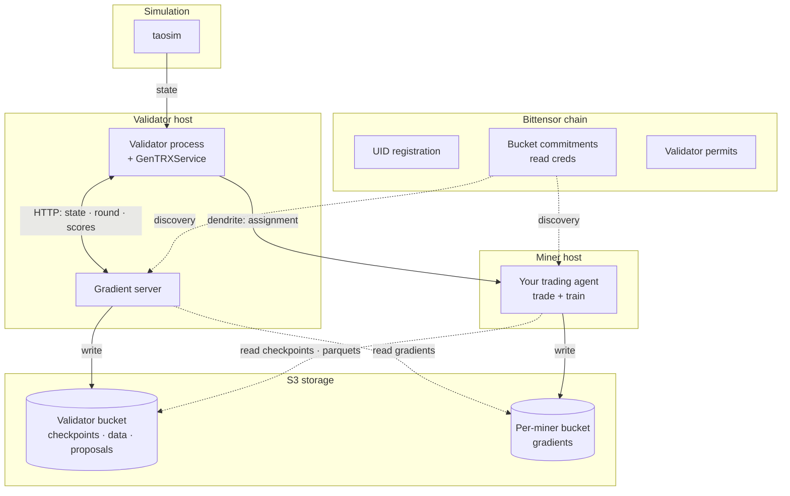
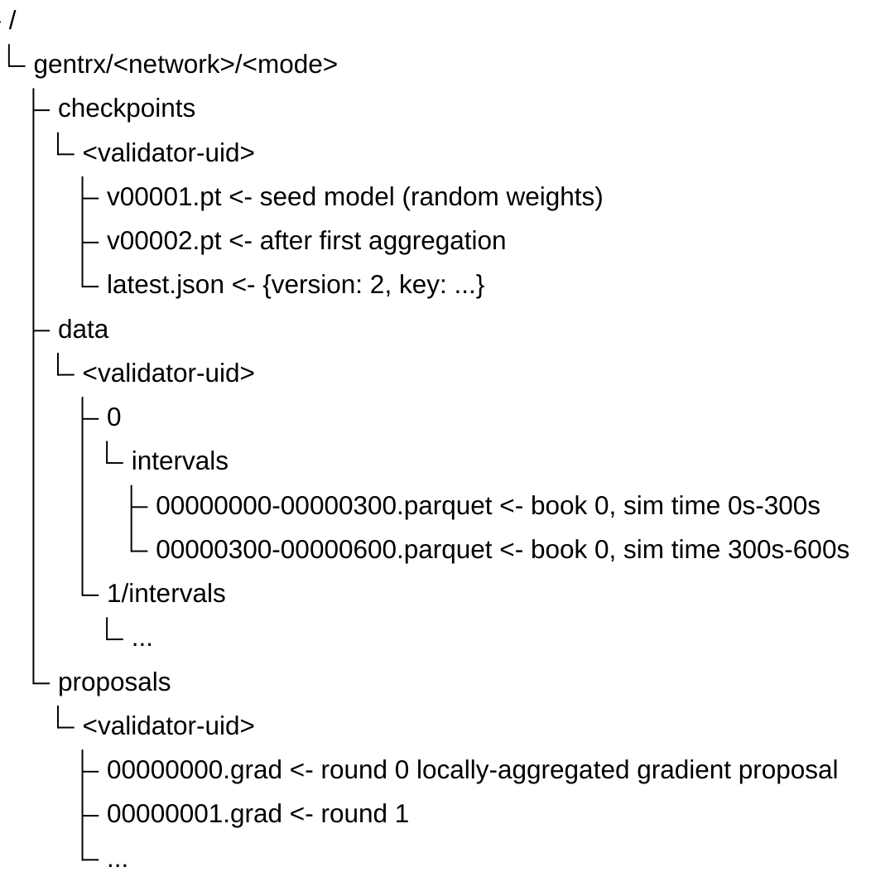
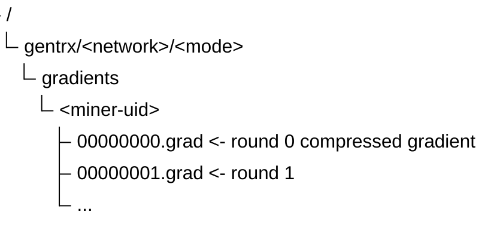
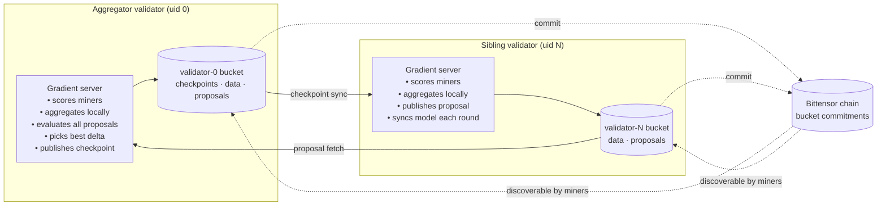
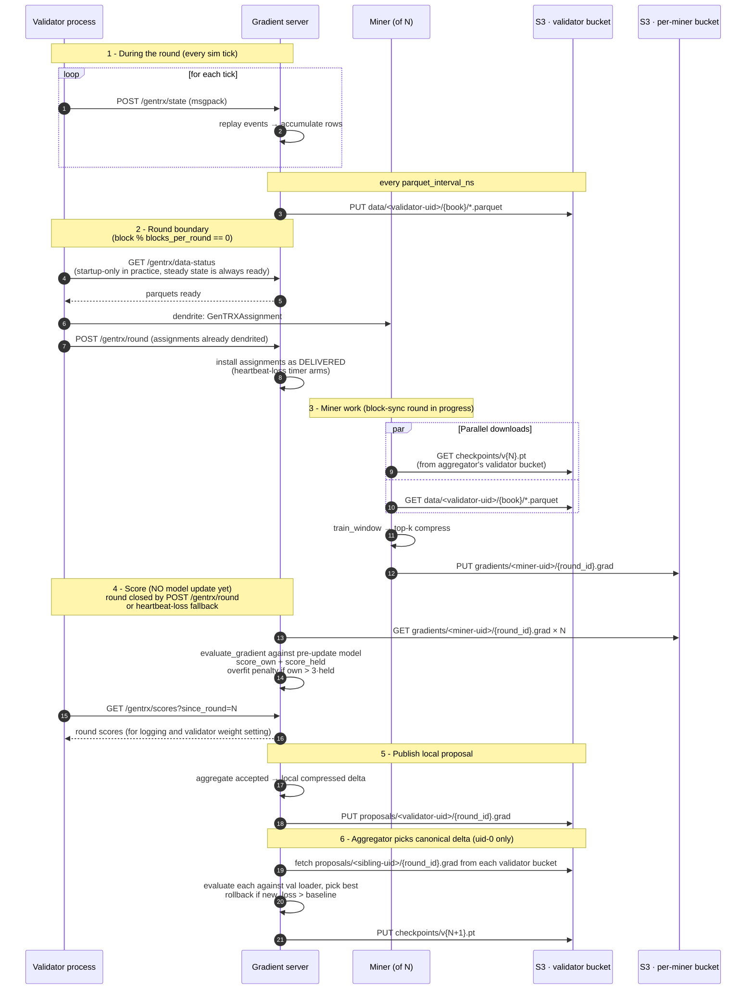
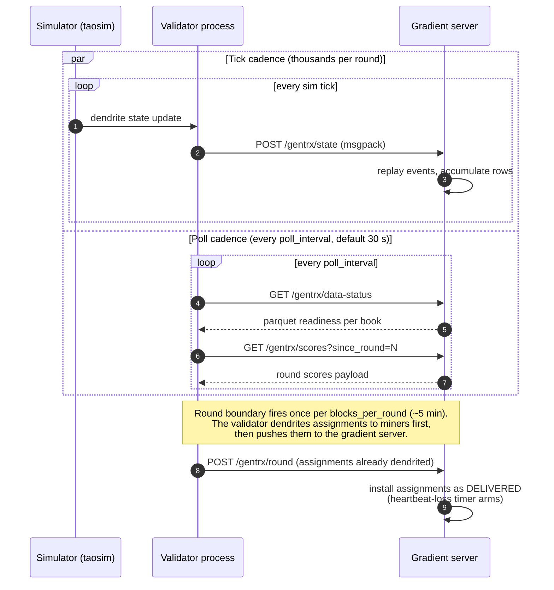
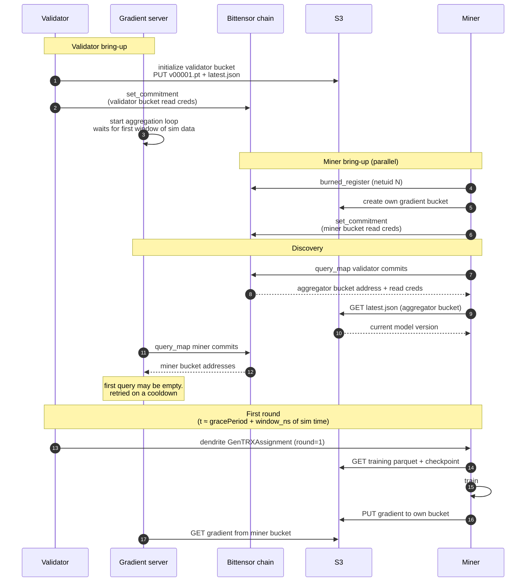
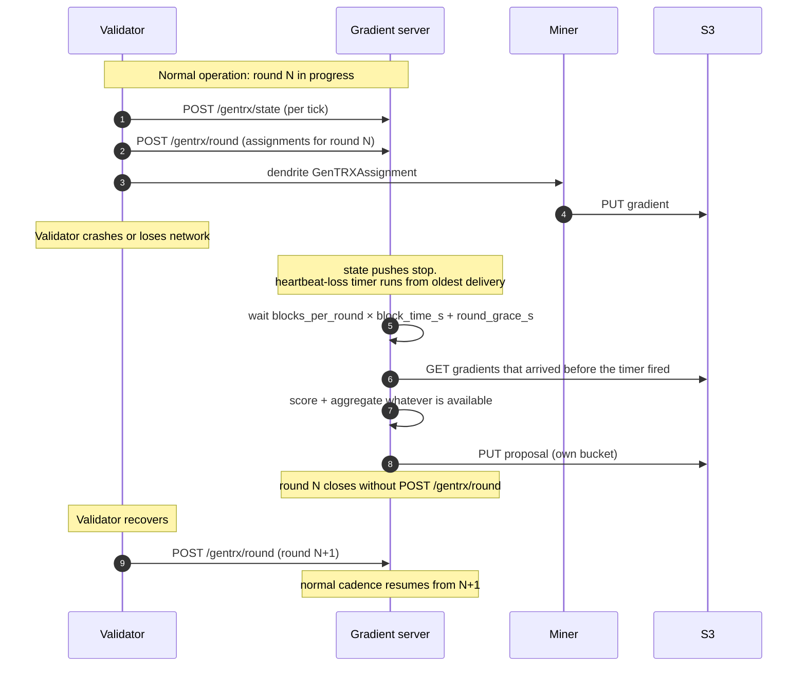
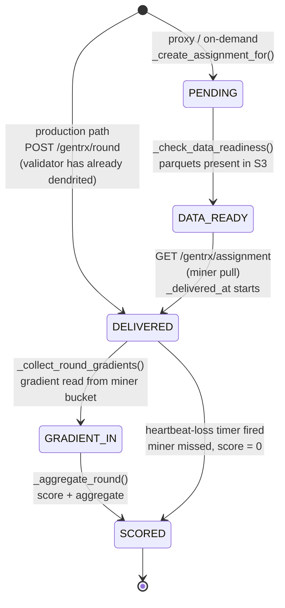

# GenTRX Data Flow & Schema

Complete data flow reference for the GenTRX distributed training system.

---

## Component Overview



---

## Two-Bucket S3 Model

### Bucket Layout: `gentrx/<network>/<mode>/`

Every key in both bucket types lives under a two-axis prefix so a single bucket can hold mainnet + testnet, and simulation + exchange shards side by side without colliding.

- `<network>` is derived from the connected subtensor: `finney` resolves to `mainnet`; everything else (`test`, `local`, custom WSS endpoints) resolves to `testnet`.
- `<mode>` is `simulation` (default) or `exchange`. Today only `simulation` has a working data path; `exchange` reserves the prefix for exchange-data training.

The shape applies to both validator and miner buckets. All key examples below show the suffix only; prepend `gentrx/<network>/<mode>/` to get the full key.

### Validator Bucket (`GENTRX_VALIDATOR_S3_*`)

**Purpose**: Single unified bucket per validator: checkpoints, training data, and aggregation proposals. Scores stay validator-local (served over loopback HTTP to the validator process; never written to S3).



**Writer**: Gradient server (checkpoints + parquets + proposals)

**Reader**:
- Miners: `checkpoints/` (model download from uid-0 only) + `data/` (training parquets)
- Aggregator gradient server (uid 0): `proposals/` from all validator buckets to pick the best-scoring delta each round
- Sibling validators: `checkpoints/` from uid-0's bucket (model sync each round) **Committed on-chain**: Read credentials committed by the validator at startup so miners and sibling validators can discover the bucket without pre-configuration.

**Notes**:
- Aggregator (uid 0) writes checkpoints, data, and proposals. Sibling validators write data and proposals only; they never publish checkpoints. There is exactly one canonical model store, the aggregator's bucket, and miners always pull the checkpoint from there regardless of which validator delivered the assignment. Sibling buckets hold data parquets and proposals for their own miners; from the model's point of view they are redundant data sources, not alternative checkpoint origins. This is why `_get_aggregator_store_for_assignment` in `taos.im.agents.GenTRXAgent` walks the chain prioritising UID 0 (or the configured `gtx_aggregator_uid`) and only falls back to the sender if the configured aggregator has no checkpoint yet.
- R2: bucket name == account_id by convention. Hippius: bucket name stored in account_id field.

### Per-Miner Buckets (`GENTRX_AGENT_S3_*`)

**Purpose**: Gradient uploads (one dedicated bucket per miner)



Key format: `gentrx/<network>/<mode>/gradients/<uid>/{round_id:08d}.grad`. UID is part of the path so several miners can share a bucket without colliding. The same bucket holds both mainnet and testnet gradients under their respective network prefixes.

**Writer**: Miner (after training) **Reader**: Gradient server (via chain-committed read credentials) **Committed on-chain**: Read credentials committed by the miner at startup via Commitments pallet.

**One gradient per round.** Each `(miner, round_id)` is read by the gradient server exactly once, scored, and locked in. A miner who PUTs the same key again before the round drains overwrites the bytes in their bucket, but those bytes are never re-read — the second submission is dead weight. The miner's contract is "post your best gradient, once." The first successful read is the version that goes through scoring and aggregation.

---

## Multi-Validator Design

Multiple validators can run simultaneously. Each has its own gradient server and its own validator bucket committed on-chain. All validators aggregate locally and publish proposals; the aggregator (uid 0) evaluates proposals and picks the best delta.



Each round, every validator aggregates its accepted miner gradients locally and publishes `proposals/<validator-uid>/{round_id:08d}.grad` to its own bucket. Uid-0's gradient server fetches proposals from every chain-committed validator bucket, evaluates each against validation data, and applies the single best-scoring delta. Sibling validators sync from uid-0's checkpoint each round to stay in lock-step.

---

## Data Formats

### State Tick Packet (in-memory / msgpack)

`StatePackager.extract_state(state)` produces this dict every sim tick. The validator sends it to the gradient server via `POST /gentrx/state` (msgpack body). Never written to S3.

```python
{
    "step": 42,                      # tick number
    "ts": 1234567890000,             # sim timestamp (nanoseconds)
    "config": {                      # only in first packet
        "priceDecimals": 8,
        "volumeDecimals": 8,
    },
    "books": {
        0: {                         # book_id
            "bids": [[100.5, 2.0], [100.4, 5.0], ...],   # [price, qty] L2 levels
            "asks": [[100.6, 1.5], [100.7, 3.0], ...],
            "events": [
                {"y": "o", "s": 0, "i": 42, "p": 100.5, "q": 1.0, "t": 1234567890000},
                {"y": "t", "Ti": 42, "Mi": 10, "p": 100.5, "q": 0.5, "t": ..., "s": 0},
                {"y": "c", "s": 0, "i": 10, "p": 100.5, "q": 0.0, "t": ...},
            ]
        },
        1: { ... },
    }
}
```

Event types:
- `"o"` = order placement (quantity is REMAINING after immediate fills)
- `"t"` = trade (Ti=taker_id, Mi=maker_id, q=filled quantity)
- `"c"` = cancellation

### Training Parquet

Written by gradient server after replaying events through `MatchingEngine`. One file per book per `_parquet_interval_ns` of sim time (default 5 min).

**Filename**: `{ddHHMMSS_start}-{ddHHMMSS_end}.parquet` (sim time range)

**Schema** (`GenTRX/src/util/schema.py`):

| Column | Type | Description |
|---|---|---|
| `timestamp` | timestamp[ns] | Event time |
| `order_type` | int8 | 0=Bid, 1=Ask, 2=Cancel |
| `rel_price` | int32 | Price ticks relative to mid |
| `volume_int` | int32 | Integer part of quantity |
| `volume_dec` | float32 | Fractional part of quantity |
| `interval_ns` | int64 | Nanoseconds since previous event |
| `mid_price` | int64 | Current mid price in ticks |
| `time_of_day_s` | int32 | Second of day (0-86399) |
| `mid_price_delta` | int32 | Mid price change from session open |
| `lob_ask_vol_1..10` | float64 | Ask volume at levels 1-10 |
| `lob_bid_vol_1..10` | float64 | Bid volume at levels 1-10 |

**Volume reconstruction**: `original_qty = remaining_qty + sum(trade.qty where trade.taker_id == order.id)`

### Model Checkpoint (.pt)

Standard PyTorch checkpoint saved via `torch.save()`.

```python
{
    "model_state_dict": OrderedDict(...),
    "optimizer_state_dict": OrderedDict(...),
    "model_config": {
        "n_types": 3, "n_price_bins": 100, "n_vol_int_bins": 64,
        "n_vol_dec_bins": 8, "n_interval_bins": 64,
        "d_model": 288, "n_layers": 8, "n_heads": 8, "d_ff": 1152,
        "max_seq_len": 2048, "dropout": 0.1, "lob_dim": 20,
        "max_mid_delta": 2000, "film_layers": [2, 5, 7], "film_d_cond": 64,
    },
    "tokenizer_config": { ... },
    "epoch": 0, "step": 42, "loss": 1.234,
}
```

### Compressed Gradient (.grad)

Binary format via `GenTRX/src/gradient.py`:

```python
{
    "metadata": {
        "window_id": 0, "miner_uid": 2,
        "steps_trained": 50,
        "loss_before": 13.77, "loss_after": 10.24,
        "loss_trajectory": [13.77, 13.5, ..., 10.24],
    },
    "sparse": {
        "backbone.layers.0.self_attn.q_proj.weight": {
            "indices": tensor([...]),
            "values": tensor([...]),
            "shape": (288, 288),
        },
        # ... per-parameter sparse deltas
    }
}
```

**Compression**: top-k sparsification (default 5%, `gtx_top_k_frac=0.05`) **Typical size**: ~2 - 4 MB per gradient

### Round Scores (JSON)

Scores stay validator-local, served over loopback HTTP via `GET /gentrx/scores` to the validator process. Not written to S3.

```json
{
    "round": 0,
    "model_version": 2,
    "scores": {
        "2": {
            "score": 0.012,
            "score_own": 0.015,
            "score_held": 0.012,
            "overfitting": false,
            "accepted": true,
            "books": ["1", "3", "4"]
        },
        "3": {
            "score": -0.04,
            "score_own": 0.10,
            "score_held": -0.04,
            "overfitting": true,
            "accepted": false,
            "books": ["2", "0", "4"]
        }
    },
    "n_scored": 2,
    "n_accepted": 1,
    "n_rejected": 1
}
```

`score_own` = improvement on the miner's assigned data. `score_held` = improvement on held-out validation books (primary quality gate). `overfitting` = true when `score_own > score_held × OVERFIT_RATIO` (default 3.0). `score` = `score_held × 0.1` when overfitting, otherwise `score_held`.

### Assignment (JSON, served via HTTP)

Delivered to miners via `GenTRXAssignment` synapse (dendrite) or HTTP GET response.

```json
{
    "round": 0,
    "model_version": 1,
    "books": ["1", "3", "4"],
    "ts_start": 40528714973,
    "ts_end": 340528714973,
    "data": [
        "data/1/intervals/00000000-00000300.parquet",
        "data/3/intervals/00000000-00000300.parquet",
        "data/4/intervals/00000000-00000300.parquet"
    ],
    "data_source": "s3",
    "data_endpoint": "https://<account_id>.r2.cloudflarestorage.com",
    "data_bucket": "<bucket-name>",
    "data_access_key": "<read-only-key>",
    "data_secret_key": "<read-only-secret>"
}
```

`data_endpoint` / `data_bucket` / `data_access_key` / `data_secret_key`: populated by the gradient server from its own validator bucket credentials. Miners use these directly so no per-validator env vars are required on the miner side. The same credentials are on chain via the validator's commitment, which is the canonical source if the inline copy is missing.

**Round closure runs on block-sync.** The validator advances rounds on the chain block counter (`--gentrx.blocks_per_round` blocks per round) and closes each one by calling `POST /gentrx/round` on the gradient server. Miners work until the next assignment arrives. The gradient server keeps a server-side heartbeat-loss fallback timer (see [`operations.md` § Failure semantics](operations.md#gradient-server-is-down)) so a stuck validator does not freeze scoring.

### On-Chain Bucket Commitment (128 chars)

Committed by both miners and validators via the Bittensor Commitments pallet. 128-char hard limit (`Raw128` is the largest supported `FieldType`).

```
[account_id: 32 chars][access_key_id: 32 chars][secret_access_key: 64 chars]
```

> **On committed credentials being public by design.** These R2 `access_key_id` /
> `secret_access_key` pairs are **read-only** and scoped to a single gradient bucket — no
> write, admin, or cross-resource access. They are published on-chain by every participant
> via the Commitments pallet, so they are public by construction. The benchmark agent config
> (`taos/im/config/benchmark_agents.testnet.json`) carries the same read-only pair inline on
> purpose; a committed literal there is intentional, not a leak. Secret scanners will flag it —
> that finding is expected and may be dismissed. Do not rotate or move these to env injection
> without also updating the on-chain commitment, or discovery breaks.

Provider auto-detection from `account_id`:
- **R2**: `account_id` matches `^[0-9a-f]{32}$` → endpoint `https://{account_id}.r2.cloudflarestorage.com`, region `auto`
- **Hippius**: anything else → `account_id` IS the bucket name, endpoint `https://s3.hippius.com`, region `decentralized`
- **MinIO (localnet)**: `account_id` = bucket name; endpoint derived from `GENTRX_CHAIN_ENDPOINT_OVERRIDE`

---

## Round Lifecycle (sequence)

One full round, from the first sim tick through checkpoint publication. Shown from the perspective of a single validator that is also the aggregator; for sibling validators, phase 6 happens on a different host and this validator's proposal is one of the inputs.

Val books are held out per validator, deterministic from `--seed` (default `42`). Operators running multiple validators may set distinct seeds so each validator sees a different held-out split.



---

## Per-Tick Cadence (sequence)

Two cadences run concurrently. State pushes happen on every sim tick, and the validator's poll cycle runs once per `poll_interval` (default 30 s wall clock). The poll cycle does not block the tick stream.



---

## Startup Handshake (sequence)

Chain commit, bucket discovery, and the first assignment. Validator and miner bring-up run independently; they only meet once both have committed their read credentials on-chain.



---

## Failure Mode: Validator Disconnect (sequence)

The most common non-fatal failure: validator stops pushing `POST /gentrx/round` (crash, network blip, upgrade restart). The gradient server falls back to a heartbeat-loss timer so the sim does not stall.



Miners whose gradients did not arrive before the timer fired score 0 for the round. The next round starts clean as soon as the validator reconnects; no manual intervention is needed on the gradient server side.

One edge case: if the validator crashes *before* dendriting any assignment for round N, the gradient server has no `DELIVERED` assignments to track, `_round_complete()` returns False, and round N stalls. The server resumes normal flow only when `POST /gentrx/round` for round N+1 arrives after recovery.

---


## Assignment Lifecycle State Machine



| State | Meaning | Entered from |
|---|---|---|
| `PENDING` | Books + window assigned; data keys not yet resolved. | Proxy / on-demand creation only. |
| `DATA_READY` | Data keys resolved; next `GET /gentrx/assignment` will deliver. | Proxy path only. |
| `DELIVERED` | Sent to the miner; `_delivered_at` clock is running. | Production: direct from `POST /gentrx/round`. Proxy: after `GET /gentrx/assignment`. |
| `GRADIENT_IN` | Miner gradient fetched from their bucket, cached in memory. | `_collect_round_gradients()` succeeded. |
| `SCORED` | Scored and rolled into the round's aggregation. Score is 0 when the miner never delivered. | `_aggregate_round()` drained pending. |

---

## Chain Interactions

| Operation | Who | When | Pallet |
|---|---|---|---|
| Miner registration | Miner operator | Once at setup | SubtensorModule (burned_register) |
| Miner bucket commitment | Miner process | On startup | Commitments (set_commitment) |
| Validator bucket commitment | Validator process | On startup | Commitments (set_commitment) |
| Read miner commitments | Gradient server | Per aggregation cycle | Commitments (query_map) |
| Read validator commitments | Aggregator grad server | Per round (cross-val scores) | Commitments (query_map) |
| Weight setting | Validator | Per scoring cycle | SubtensorModule (set_weights) |

### Commitment format (128 chars)

```
┌──────────────┬──────────────┬──────────────────────────────┐
│ account_id   │ access_key   │ secret_access_key            │
│ (32 chars)   │ (32 chars)   │ (64 chars)                   │
└──────────────┴──────────────┴──────────────────────────────┘
```

128-char hard limit; `Raw129` fails at codec level in the Commitments pallet. R2 account IDs are always 32 lowercase hex chars (`[0-9a-f]{32}`), which is what triggers provider auto-detection.

---

## Environment Variable Map

### Validator host

| Var | Purpose |
|---|---|
| `GENTRX_VALIDATOR_S3_BUCKET` | This validator's own bucket (checkpoints + data + proposals) |
| `GENTRX_VALIDATOR_S3_ACCOUNT_ID` | R2 account ID (optional; defaults to bucket name) |
| `GENTRX_VALIDATOR_S3_READ_ACCESS_KEY/SECRET_KEY` | Read creds committed on-chain for miner discovery |
| `GENTRX_VALIDATOR_S3_WRITE_ACCESS_KEY/SECRET_KEY` | Write creds for gradient server (never leave this host) |
| `GENTRX_CHAIN_ENDPOINT_OVERRIDE` | S3 endpoint for on-chain discovered buckets (MinIO only; empty for R2/Hippius) |
| `GENTRX_API_KEY` | Shared secret for `/state`, `/round`, `/data-status`, `/scores` |

### Gradient server host

Same `GENTRX_VALIDATOR_S3_*` as the validator it serves (write creds used). `GENTRX_CHAIN_ENDPOINT_OVERRIDE` for miner bucket discovery (MinIO only).

### Miner host

| Var | Purpose |
|---|---|
| `GENTRX_AGENT_S3_BUCKET` | Own gradient upload bucket |
| `GENTRX_AGENT_S3_ENDPOINT_URL` | Own bucket endpoint |
| `GENTRX_AGENT_S3_ACCESS_KEY/SECRET_KEY` | Own bucket write creds |
| `GENTRX_AGENT_S3_READ_ACCESS_KEY/SECRET_KEY` | Own bucket read creds (committed on-chain) |
| `GENTRX_AGENT_S3_ACCOUNT_ID` | R2 account ID (optional; defaults to bucket name) |

The miner's own bucket is the only S3 namespace it needs to configure. The uid-0 checkpoint bucket and every per-validator data bucket are read from chain commitments at runtime. Assignment payloads echo the sending validator's data bucket credentials (`data_endpoint`, `data_bucket`, `data_access_key`, `data_secret_key`) inline so the miner can fetch without a chain round-trip.
