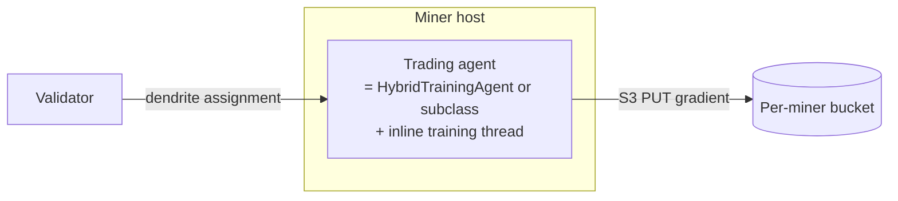
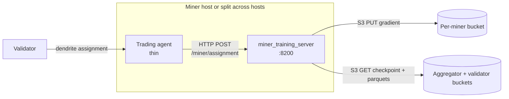
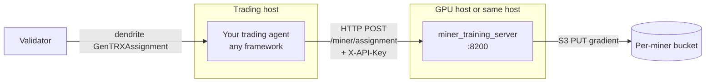

# GenTRX Miner Setup

GenTRX miners run a trading agent that *also* trains the model each training round. Trading earns kappa, model gradients are scored against held-out data and rolled into the next checkpoint.

> **Training reward.** Miner rewards split between trading and training. Default is 95% trading / 5% training, set by `--scoring.gentrx.simulation_share` on the validator side. The training allocation scales with participation (`N_active / N_registered_miners`); whatever training does not claim returns to trading. When GenTRX is not running on the validator, 100% of rewards go to trading regardless of this setting. For production parameter values active on mainnet, see the MVTRX (SN-79) incentive mechanism in the [repo README](../../README.md#mechanism). Running GenTRX always contributes to the shared model lineage and to the kappa / PnL components of your score, in addition to the training pool.

---

## Quickstart: running a GenTRX miner

The simplest path is a single command - `run_miner.sh -G` handles bucket prompts, chain commitment, and pm2 setup on first run. Subsequent updates require no input.

```bash
./run_miner.sh -G -w <coldkey> -h <hotkey> -u 79 -a 8091
```

**First run** - the script will:
1. Prompt for your R2/Hippius bucket credentials (write + read tokens); see [Step 1: Create the bucket](#step-1-create-the-bucket)
2. Verify bucket access and commit the read credentials on-chain
3. Save all configuration to `.env` and print a complete reusable command - useful as a template for additional UIDs (adjust `-w`/`-h`/`-a`)

**Subsequent update runs** - no flags needed:
```bash
./run_miner.sh   # restores saved config from .env, no prompts
```

**Override training params for a single run** without changing saved config:
```bash
./run_miner.sh -t "gtx_train_steps=100 gtx_train_batch_size=8"
```

**`run_miner.sh` flags relevant to GenTRX:**

| Flag | Description |
|------|-------------|
| `-G` | Enable GenTRX distributed training (boolean, no argument) |
| `-n <agent>` | Agent class name (default on first `-G` run: `HybridTrainingAgent`) |
| `-m "<params>"` | Agent strategy params (`param=val ...`) |
| `-t "<params>"` | GenTRX training params to override (`gtx_key=val ...`) |

For the complete flag reference see the [README Run section](../../README.md#run-miner).

---

### Manual / step-by-step setup

If you prefer to manage each step individually, the five steps below describe the full process. If something stops working jump to [Troubleshooting](#troubleshooting). For the bigger-picture choice (inline vs split topology, pure training) see [Choosing your trading mode](#choosing-your-trading-mode).

1. **[Bucket](#step-1-create-the-bucket).** Create one R2 (or Hippius) bucket. Generate two API tokens on the bucket: write (private) + read (committed on-chain).
2. **[On-chain commit](#step-2-commit-your-bucket-on-chain).** `python bin/setup_miner_bucket.py …` verifies the tokens and writes the read pair to the chain so validators can find you.
3. **[Env vars](#step-3-set-env-vars).** Drop your `GENTRX_AGENT_S3_*` keys plus the uid-0 `GENTRX_AGGREGATOR_S3_*` bootstrap pair into `.env`.
4. **[Launch](#step-4-launch).** Run `bin/gentrx_preflight` first, then run `./run_miner.sh -G …`. pm2-supervised, default agent is `HybridTrainingAgent`.
5. **[Verify](#step-5-verify).** `pm2 logs miner | grep "\[GTX\]"` should show bucket commit success, assignments arriving, gradients uploading.

---

## What you need

- Bittensor wallet, registered on the subnet.
- GPU recommended.
- One bucket from **R2**, **Storj**, or **Hippius**. The on-chain commitment is fixed at 128 bytes (account_id + access_key + secret); these are the providers that fit.
- Project Python venv (e.g. `venv/sn79/`) with deps installed (`pip install -e .`).

---

## Step 1: Create the bucket

### Cloudflare R2

1. Cloudflare → Storage → R2 → Sign up (payment method required).
2. Note your **R2 account ID**, the 32-char hex visible in the R2 dashboard URL. Endpoint derives: `https://<account_id>.r2.cloudflarestorage.com`.
3. Create one bucket. Convention is to name it the same as your account ID (R2 stores bucket name == account_id by default in the on-chain commitment).
4. Generate **two API tokens** (Manage R2 API Tokens → Create):
   - **Write token**: "Object Read & Write" on this bucket. Stays on your miner host. Used to upload gradients. Do not share the write token.
   - **Read token**: "Object Read" on this bucket. Goes on-chain so validators can pull your gradients. Public-by-design.

   Each token entry in the R2 dashboard exposes three fields: a **Token Value** (long bearer string for the Cloudflare API — ignore it), an **Access Key ID**, and a **Secret Access Key**. The wizard and `bin/setup_miner_bucket.py` use the latter two; bearer tokens are not part of the chain commitment.

### Storj

1. Storj → sign up at `storj.io` (free trial available).
2. Create one bucket via the Storj UI. Pick any DNS-safe name.
3. Generate **two S3-compatible access keys** (Access → Create S3 Credentials):
   - **Write grant**: full read + write on the bucket. Stays on your miner host. Used to upload gradients.
   - **Read grant**: GetObject only on the bucket. Goes on-chain. ListBucket is not required because validators read gradient keys deterministically.

Endpoint is `https://gateway.storjshare.io` (static). Region is `global`. Access key is 28 chars, secret is 53 chars (both base32, fixed length).

Pass `--provider storj --bucket <name>` to the helper in Step 2.

### Hippius

Decentralised S3 alternative. Same flow: account → bucket → write token + read token. Hippius does not need an `account_id`. Pass `--provider hippius --bucket <name>` to the helper in Step 2.

[↑ back to Quickstart](#quickstart-running-a-gentrx-miner)

---

## Step 2: Commit your bucket on-chain

`bin/setup_miner_bucket.py` creates the bucket if missing, verifies read+write actually work, and writes the read credentials on-chain via the Commitments pallet. Validators discover miner buckets from this commitment. No manual coordination.

Set credentials as environment variables first (keeps them out of the process list):

```bash
export GENTRX_AGENT_S3_ACCESS_KEY=<WRITE_ACCESS_KEY>
export GENTRX_AGENT_S3_SECRET_KEY=<WRITE_SECRET_KEY>
export GENTRX_AGENT_S3_READ_ACCESS_KEY=<READ_ACCESS_KEY>
export GENTRX_AGENT_S3_READ_SECRET_KEY=<READ_SECRET_KEY>

venv/simulator/bin/python bin/setup_miner_bucket.py \
    --provider r2 \
    --account-id <R2_ACCOUNT_ID> \
    --wallet-name <coldkey> \
    --wallet-hotkey <hotkey> \
    --netuid 79 \
    --subtensor-network finney
```

For Storj pass `--provider storj --bucket <name>`. For Hippius pass `--provider hippius --bucket <name>`. Endpoint and region are derived from the provider; override with `--endpoint` / `--region` only if you have a reason to.

Pass `--dry-run` first to print the commitment string without sending the chain transaction. The verification step uploads a small probe object with the write token and reads it back with the read token. Catches misconfigured token permissions before they hit chain.

If commitment fails (wallet not registered, insufficient TAO, RPC hiccup) the miner process will **hard-fail at startup** rather than run undiscoverable.

[↑ back to Quickstart](#quickstart-running-a-gentrx-miner)

---

## Step 3: Set env vars

Drop these into `.env` next to the runner script:

```bash
# Your gradient bucket (write side, stays on this host)
GENTRX_AGENT_S3_PROVIDER=r2                          # r2 | storj | hippius
GENTRX_AGENT_S3_BUCKET=<your-bucket-name>            # for R2: same as account_id
GENTRX_AGENT_S3_ACCESS_KEY=<your-write-key>
GENTRX_AGENT_S3_SECRET_KEY=<your-write-secret>

# Same bucket, read side. Same pair you committed on-chain in Step 2.
GENTRX_AGENT_S3_READ_ACCESS_KEY=<read-only-key>
GENTRX_AGENT_S3_READ_SECRET_KEY=<read-only-secret>

# R2 only: account ID for endpoint derivation. Optional if bucket == account_id.
# GENTRX_AGENT_S3_ACCOUNT_ID=<r2-account-id>

# uid-0 aggregator bucket: first-boot fallback for the canonical
# checkpoint, before the aggregator's chain commitment propagates.
# Find these in the MVTRX Discord pinned message or SUBNET_BOOTSTRAP.md.
GENTRX_AGGREGATOR_S3_ENDPOINT_URL=https://<account_id>.r2.cloudflarestorage.com
GENTRX_AGGREGATOR_S3_BUCKET=<aggregator-bucket>
GENTRX_AGGREGATOR_S3_ACCOUNT_ID=<aggregator-account-id>
GENTRX_AGGREGATOR_S3_READ_ACCESS_KEY=<published-read-key>
GENTRX_AGGREGATOR_S3_READ_SECRET_KEY=<published-read-secret>
```

In steady state the miner discovers uid-0's bucket from chain. The `GENTRX_AGGREGATOR_S3_*` block above is the bootstrap fallback for first boot before the chain commitment propagates. Full discovery order is documented in [`validator_setup.md` § Bucket Setup](validator_setup.md#bucket-setup).

[↑ back to Quickstart](#quickstart-running-a-gentrx-miner)

---

## Step 4: Launch

### Pre-launch check

Run [`bin/gentrx_preflight`](preflight.md) first. It walks dependencies, subtensor connectivity, S3 access, wallet registration, and the chain commitment you wrote in Step 2, all read-only:

```bash
# Mainnet (chain endpoint and netuid 79 are derived from --env mainnet)
venv/simulator/bin/python bin/gentrx_preflight \
    --role miner \
    --env mainnet \
    --wallet-name <coldkey> \
    --wallet-hotkey <hotkey>

# Testnet (same defaults; --netuid only if your testnet subnet is not 79)
# venv/simulator/bin/python bin/gentrx_preflight \
#     --role miner --env testnet \
#     --wallet-name <coldkey> --wallet-hotkey <hotkey>
```

A single `[FAIL]` is enough to abort. Read the message, fix, rerun. Full reference in [`preflight.md`](preflight.md).

### Launch

Run `run_miner.sh` with the `-G` flag. On first run it prompts for credentials; on all subsequent runs it restores saved configuration from `.env` with no input needed:

```bash
# First run - prompts interactively, commits bucket on-chain, saves config:
./run_miner.sh -G -w <coldkey> -h <hotkey> -u 79 -a 8091

# Update / restart - no flags needed:
./run_miner.sh
```

The script runs `pip install -e .`, deletes any prior `miner` pm2 process, launches a fresh one under pm2, saves the process list, and tails the logs.

After first setup the script prints a complete reusable command - copy it. It includes all flags with saved values and is useful as a template when running multiple UIDs: copy it and adjust `-w`/`-h`/`-a` per UID.

**Default agent** is `HybridTrainingAgent` with sensible `gtx_*` training defaults. Pass `-n <AgentClass> -m "<params>"` to use your own agent.

`HybridTrainingAgent` is a **template, not a finished strategy**. Identical defaults across miners will front-run each other and the imbalance signal vanishes. Tune the entry threshold, sizing, and risk params (or replace the signal entirely) before deploying seriously.


[↑ back to Quickstart](#quickstart-running-a-gentrx-miner)

---

## Step 5: Verify

Every GenTRX log line carries a `[GTX]` prefix. Tail the logs and grep:

```bash
pm2 logs miner | grep "\[GTX\]"
```

Expected log lines in the first few minutes:

- `GenTRX bucket committed on-chain: account=…`. Step 2 worked.
- `S3 aggregator bucket fallback: …`. Step 3 env vars loaded.
- `GenTRX assignment received: round=N, books=[…], data=K files`. Validator found you and dendrited an assignment.
- `gradient uploaded to S3 (round=N)`. Your gradient hit your bucket.

### Expected timeline on first boot

There are two unavoidable wait points before assignments arrive. Not bugs, just physics:

1. **First assignment (~10-15 min on finney).** Sim grace period is 10 min (no state emitted), then the gradient server needs one training-window worth of parquets (5 min default) before it can carve up the first round. If your validator just started too, add its startup cost.
2. **First training trigger.** The agent will not call `train()` until it sees its first assignment for the round. Until then `train.log` is empty even though the miner is healthy.

If `[GTX] assignment received` never appears after ~20 min, jump to [Troubleshooting](#troubleshooting). The first three rows cover the common bucket / chain-commitment causes.

### Confirm uploads

Confirm gradients are landing in your bucket. Easiest path is the **Cloudflare R2 dashboard**. Open your bucket and watch the `gentrx/<network>/<mode>/gradients/NNNNNNNN.grad` files (8-digit zero-padded round IDs, under the network/mode prefix you launched with — e.g. `gentrx/mainnet/simulation/gradients/`) appear ~once per round. Hippius operators have an equivalent dashboard at the Hippius web UI.

If you'd rather stay in the terminal, the project's existing boto3 dependency does the same listing without any extra install:

```bash
venv/simulator/bin/python - <<'PY'
import os, boto3
acct = os.environ["GENTRX_AGENT_S3_BUCKET"]  # for R2: same as account_id
s3 = boto3.client(
    "s3",
    endpoint_url=f"https://{os.environ.get('GENTRX_AGENT_S3_ACCOUNT_ID', acct)}.r2.cloudflarestorage.com",
    aws_access_key_id=os.environ["GENTRX_AGENT_S3_ACCESS_KEY"],
    aws_secret_access_key=os.environ["GENTRX_AGENT_S3_SECRET_KEY"],
    region_name=os.environ.get("GENTRX_AGENT_S3_REGION", "auto"),
)
network = "mainnet"  # "testnet" if not on finney
mode = "simulation"
resp = s3.list_objects_v2(Bucket=acct, Prefix=f"gentrx/{network}/{mode}/gradients/")
for obj in resp.get("Contents", []):
    print(f"{obj['Key']:<60} {obj['Size']:>10} bytes")
PY
```

For Hippius point `endpoint_url` at `https://s3.hippius.com` instead.

Confirm the chain commitment:

```bash
btcli commit show --netuid 79 --uid <your-uid>
```

Returns the 128-char hex string you committed in Step 2.

### Cold storage (recommended)

Your bucket is hot storage. The miner prunes `gradients/` to the newest `gtx_keep_gradients` entries after every upload (default 50, ≈4h of history; set 0 to disable). If you want a long-term record of your gradients (post-mortem, model audit, replay against a future checkpoint) pull files to cheaper cold storage yourself. A nightly sync to your archive of choice is the usual pattern: `aws s3 sync`, `rclone copy`, or `mc mirror` all speak the R2 / Hippius S3 API. We do not bundle an archival path because per-miner retention preferences vary.

### One gradient per round

The gradient server reads each `(miner, round)` key exactly once. The first successful read is what gets scored, and the score is final for that round. If you `PUT` again under the same key before the round drains, the bucket bytes change but the server has already moved on — the resubmission is wasted. Treat each round as a single shot: post your best gradient, then stop touching that key until the next round.

This also means there is no advantage to uploading early then revising late. Score the gradient once locally, decide it is your best, then upload.

[↑ back to Quickstart](#quickstart-running-a-gentrx-miner)

---

## Choosing your trading mode

Four deployments to pick from. Most miners stay on the default; the others are for specific operational needs. The full integration recipe for each (HTTP contract, inheritance contract, sequence diagrams, failure modes, cross-machine TLS) lives in [`integration.md`](integration.md). This section is just the decision matrix.

### Combined: agent + inline training (default)



What `./run_miner.sh -G` does. One process, `HybridTrainingAgent` (or any agent with `gtx_training_enabled=true`), training runs in a background thread on the same GPU. Simplest path. Subclass contract: [`integration.md` § Path 1](integration.md#path-1-subclass-gentrxagent).

### Split: agent forwards to a standalone training service



Trading agent stays thin and forwards each assignment over HTTP to the standalone `miner_training_server`. Use when trading restarts must not disturb in-flight training, or when training and inference need different GPUs. Same code path on one host or two.

In your runner, append `gtx_training_url` to `GENTRX_PARAMS`:

```sh
GENTRX_PARAMS="$GENTRX_PARAMS gtx_training_url=http://127.0.0.1:8200"
# add gtx_training_api_key=$GENTRX_MINER_API_KEY when cross-machine
```

Service CLI, cross-machine TLS (cloudflared / ngrok / private network), payload schema, failure modes, operator-responsibility split: [`integration.md` § Path 2](integration.md#path-2-http-api-to-miner_training_server).

### Bring your own trading agent (HTTP API)



Same topology as Split, but the trading agent is not a Python subclass of `GenTRXAgent`; it serialises the dendrite payload and POSTs it to the training service directly. Steps 1-3 above still apply (bucket, chain commit, `GENTRX_AGENT_S3_*` on the training-service host); bittensor wiring (hotkey, axon, dendrite reception) stays on the trading agent. Full recipe: [`integration.md` § Path 2](integration.md#path-2-http-api-to-miner_training_server).

### Pure training: model only, no trading

`HybridTrainingAgent` (or any agent with `gtx_training_enabled=true` and no strategy logic) runs the training loop without placing meaningful orders. `GenTRXAgent` is the abstract base class in `taos.im.agents` - it cannot be launched directly. Use `HybridTrainingAgent` for a training-only run:

```sh
AGENT_NAME=HybridTrainingAgent
STRATEGY_PARAMS=""
# GENTRX_PARAMS unchanged
```

Same five steps; training-only path, no order placement.

[↑ back to Quickstart](#quickstart-running-a-gentrx-miner)

---

## Configuration Parameters

`--agent.params` is a flat `key=value` list. Every GenTRX-owned key is prefixed with `gtx_` so it cannot collide with strategy-owned keys when this agent is subclassed by another model-using trader.

### Training

| Param | Default | Description |
|---|---|---|
| `gtx_training_enabled` | `true` | Training is **on by default**. Set to `false` to opt out. |
| `gtx_train_steps` | `50` | Iterations per training window. |
| `gtx_train_batch_size` | `16` | Sequences per batch. Drop to `8` on tight VRAM (localnet launchers use `8`). |
| `gtx_train_seq_len` | `256` | Tokens per sequence (also min observations for inference). |
| `gtx_train_lr` | `1e-4` | Learning rate per training window. |
| `gtx_top_k_frac` | `0.01` | Gradient sparsification (1% retention ≈ 100× compression). |
| `gtx_keep_gradients` | `50` | Hot-bucket retention. `gradients/<own-uid>/{round_id:08d}.grad` older than the newest N are deleted after every upload. `0` disables - recommend pairing with cold-storage mirror. |
| `gtx_aggregator_uid` | `0` | UID of the canonical-checkpoint aggregator. Mainnet leaves this default; localnet uses `1`. |
| `gtx_mode` | `simulation` | Bucket-prefix shard. Combined with the connected subtensor network (finney → `mainnet`, else `testnet`) to produce `gentrx/<network>/<mode>/`. Leave at `simulation` unless instructed otherwise; `exchange` reserves the prefix for future exchange-data training. |
| `gtx_training_url` | (unset → inline) | When set, agent forwards assignments to this URL (e.g. `http://127.0.0.1:8200`) instead of training in-process. See [Choosing your trading mode](#choosing-your-trading-mode). |
| `gtx_training_api_key` | (unset → no auth) | Shared secret sent as `X-API-Key` to the forwarding URL. Also reads `$GENTRX_MINER_API_KEY`. |

### Data collection (optional)

| Param | Default | Description |
|---|---|---|
| `gtx_collect_data` | `true` | Write parquets locally. Launch examples pass `false`; set true only for offline analysis. See note below. |
| `gtx_output_dir` | `agents/data/<uid>` | Local cache + log + (optional) parquet root. `<uid>` is your on-chain UID, set automatically by `run_miner.sh`. |
| `gtx_flush_interval_ns` | `3_600_000_000_000` | Sim-time interval per parquet file (1h default). |
| `gtx_gradient_dir` | `<gtx_output_dir>/gradients` | Where local gradient pending dir + train.log live. |

### Inference (optional, experimental)

| Param | Default | Description |
|---|---|---|
| `gtx_n_trajectories` | `0` | Forecast trajectories per book per tick. `0` disables. |
| `gtx_n_gen_orders` | `50` | Orders generated per trajectory. |
| `gtx_temperature` | `1.0` | Sampling temperature. |
| `gtx_signal_threshold` | `0.001` | \|signal\| above which the agent submits a market order. |
| `gtx_quantity` | `1.0` | Inference order size in base units. |
| `gtx_checkpoint` | (unset) | Optional local `.pt` to bootstrap from before chain discovery. |

### Strategy params (subclass-owned, unprefixed)

These belong to the trading strategy, not GenTRX:

- `HybridTrainingAgent`: `imbalance_depth`, `history_retention_mins`, `entry_threshold`, `cancel_threshold`, `stop_loss_bps`, `base_quote_size`, `enter_size_mult`, `max_flat_inventory`, `expiry_period`, `max_fee_rate`. See the agent's module docstring for tuning guidance.
- `RandomMaker*` / `RandomTaker*`: `min_quantity`, `max_quantity`, `min_leverage`, `max_leverage`, `expiry_period`, `max_fee_rate`.

### Local parquet archive (`gtx_collect_data`)

`gtx_collect_data` defaults to `true` in code, but the launch commands above pass `false`. For standard S3 training you do not need local collection: the miner receives training parquets from the validator bucket each round and uploads gradients to its own bucket. Enabling local collection costs CPU per tick (event replay through an internal matching engine) and disk (local parquet writes) with no effect on scoring.

Set `gtx_collect_data=true` only if you want your miner's exposure written to disk as parquet for offline analysis, backfill, or audit. Output lands in `<gtx_output_dir>/<book_id>/<ddHHMMSS>-<ddHHMMSS>.parquet`, schema-compatible with the S3 parquets consumed by training. When enabled, training is triggered every `train_after_flushes` local flushes (default `3`) instead of on assignment arrival, so the cadence decouples from the validator.

---

## Monitoring

### Logs

```bash
# Per-agent training log (uid = your on-chain UID, set in gtx_output_dir)
tail -f agents/data/<uid>/gradients/train.log

# Miner stdout: GenTRX bucket commit, assignment received logs.
pm2 logs miner
```

### Verify gradient uploads

Watch your bucket on the Cloudflare R2 (or Hippius) dashboard for new `gradients/NNNNNNNN.grad` entries. One per round in steady state. For a terminal check use the boto3 snippet from [Step 5](#step-5-verify); no AWS CLI install needed.

### Verify chain commitment

```bash
btcli commit show --netuid 79 --uid <your-uid>
```

Should return your 128-char commitment string.

### Running in production

For a long-running miner on a real server (not a quick local test), see [`operations.md`](operations.md). It covers pm2 and systemd unit files, log rotation, automatic restart on crash, and what to do when something fails mid-round. Read it before you set the miner up to run unattended.

---

## Troubleshooting

| Problem | Likely cause | Fix |
|---|---|---|
| `GenTRX bucket commit failed` at startup | Wallet not registered, or insufficient TAO for commit | Check registration, balance |
| `download failed for all files` | Validator bucket unreachable or chain commitment missing | Check validator is running and committed its bucket |
| `no model loaded - skipping` | First boot, validator hasn't published a checkpoint yet | Wait for validator to start and publish initial checkpoint |
| `assignment received` but no training | `gtx_training_enabled=false` explicitly set, or `agent.params` missing | Check launch command; training is on by default |
| `unexpected S3 key format` | Stale assignment from old test | Restart miner |
| Gradient uploads but validator never scores them | Read creds in chain commitment don't actually work | Test read access manually with the committed creds |
| `_maybe_train failed:` in train.log every round | Bug in subclass `respond()` clobbering parent state, or model deepcopy OOM | Check `agents/data/<uid>/gradients/train.log` traceback. Drop `gtx_train_batch_size` if OOM. Verify subclass calls `super().respond()`. |
| Training never advances past `loss_before` → `loss_after` once | Background thread crashed and `_training_in_progress` got stuck `True` | Restart miner. Inspect `train.log` for the traceback; this is a bug worth filing. |
| `S3 upload failed: ... - saving for retry` repeating | Per-miner bucket creds wrong, or R2 / Hippius outage | Check `gradients/pending/` accumulating. Test bucket write manually with the env-var creds. Backoff caps at 300 s; once S3 returns the pending dir drains automatically. |
| Inference runs but training silently doesn't | `gtx_training_enabled=false` explicitly passed, or strategy subclass shadowed it | Training defaults to on; verify `--agent.params` does not include `gtx_training_enabled=false`. |

### Benign startup warnings

These appear once at miner boot and are safe to ignore:

| Log line | What it is |
|---|---|
| `ERROR \| string indices must be integers` immediately followed by `INFO \| GenTRX bucket committed on-chain: ...` | Bittensor's RPC deserializer logs its own ERROR while checking whether an existing commitment matches (there isn't one on first boot). Our code catches the exception and proceeds to write the commitment - which you see succeed on the next line. Cosmetic noise from the bittensor SDK, not a failure. |
| `RequestsDependencyWarning: urllib3 (X.X.X) doesn't match a supported version!` | `requests` checks transitive versions at import against hard-coded upper bounds. Newer urllib3/chardet are functionally fine; the warning is cosmetic. |

---

## Hardware Recommendations

- **GPU**: NVIDIA, 8GB+ VRAM minimum (12M model, batch=8, seq=256 fits easily on RTX 3060+)
- **RAM**: 16GB+ (parquet caching, model weights, gradient compression)
- **Disk**: 50GB+ (model + cached parquets + logs)
- **Network**: stable connection to subtensor + R2 (gradient upload is small, ~1-5 MB per round)

CPU-only training works but is significantly slower and may not finish before the next round arrives. Rounds advance on the validator's block-sync schedule (`--gentrx.blocks_per_round`, configurable; the operator may retune it as the network evolves). The gradient server keeps a server-side heartbeat-loss fallback so scoring continues if the validator stops pushing round closures; see [`operations.md`](operations.md) for the failure-mode runbook.
