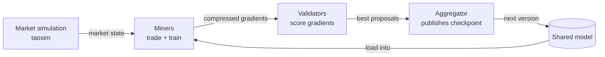

# GenTRX 
## Overview

GenTRX is the distributed training module for **MVTRX** (SN-79). Miners and validators collaborate to train a shared generative model of Level-3 order book activity: miners download training data and upload compressed gradients, a designated aggregator picks the best accepted delta each round and publishes the next checkpoint. Training runs during live simulations, so the model learns from the same market dynamics miners are exposed to.

This page is the entry point for anyone running or deploying GenTRX. For the incentive mechanics and model internals, follow the links in the [Document map](#document-map).

---

## Quick start

> **Repo already set up?** `pip install -e .` and jump to your role. Starting from zero (system deps, venv, taosim binary)? See [`install.md`](install.md) first.

### Running a miner

Full path: [`miner_setup.md`](miner_setup.md). Quickstart:

1. Create one R2 (or Hippius) bucket. Generate write + read tokens.
2. Commit the read pair on-chain with `bin/setup_miner_bucket.py`.
3. `GENTRX_AGENT_S3_*` into `.env`.
4. Run [`bin/gentrx_preflight`](preflight.md) to verify deps, S3 reach, wallet registration, and chain commitments before launch.
5. Run `./run_miner.sh -G -w <coldkey> -h <hotkey> -u 79` - handles bucket prompts, chain commit, and pm2 launch on first run.
6. `pm2 logs miner | grep "\[GTX\]"` should show assignments arriving and gradients uploading.

### Running a validator

Full path: [`validator_setup.md`](validator_setup.md). Quickstart:

1. Create one R2 (or Hippius) bucket. Generate write + read tokens.
2. Set `GENTRX_VALIDATOR_S3_*` env vars. The validator process commits the read pair on-chain at startup.
3. Run [`bin/gentrx_preflight`](preflight.md) to verify deps, S3 reach, wallet registration, and chain commitments before launch.
4. Run `./run_validator.sh -G -w <coldkey> -h <hotkey> -u 79` — starts the gradient server and validator together on first run, no flags needed on subsequent runs. For a separate GPU machine, run `./run_gradients.sh -G` on the GPU host first, then `./run_validator.sh -Q http://<gpu-host>:8100/gentrx` on the validator host.
5. `pm2 logs validator | grep "\[GTX\]"` should show round transitions and checkpoint publishes.

### First time, just learning

Full path: [`architecture.md`](architecture.md) for the design, [`testing.md`](testing.md) for the local tests.

1. Run the proxy test: `agents/proxy/run`. No chain, no real S3, end-to-end in roughly 5 minutes on one machine.

---

## The model and where it goes

GenTRX is a **~12M-parameter transformer**, deliberately small so an **RTX‑3060‑class GPU** can run training concurrently with trading. The architecture, tokenizer, training loop, bucket layout, assignment protocol, and scoring pipeline accommodate 30M, 60M, and mixed-precision variants without requiring any changes to the operator‑facing workflow. Our target hardware envelope is documented below; as training matures we anticipate releasing larger variants that remain fully compatible with the existing workflow.

> **Note:**
> - In future releases, a larger model variant may replace the current 12 M version.
> - If an expanded hardware envelope becomes necessary, we will announce it explicitly in the release notes.

---

## What happens each round

Each round is short, about five minutes on finney with the default `blocks_per_round=25`. Miners receive a slice of sim state for their assigned books and time window, train locally on it, and submit a compressed gradient.  Validators score every gradient against held-out data to block overfitting, and the aggregator applies the single best-scoring proposal.

The new checkpoint loads into every miner at the start of the next round and the cycle repeats.

For the full mechanism, chain commitments, S3 layout, HTTP routes, the round-lifecycle state machine, see [`data_flow.md`](data_flow.md).

### Central aggregator

A **single designated validator** publishes the canonical checkpoint each round. This aggregator is operated by the MVTRX team during PoC and mainnet bring-up to keep the model lineage coherent. Other validators (*sibling validators*) score locally and submit aggregation proposals, but they do not need to publish checkpoints themselves; the aggregator evaluates all proposals and picks the best delta.

See [`validator_setup.md`](validator_setup.md) for the UID configuration.

### Scoring and weights

Gradient quality is scored against held-out data each round (with an overfit penalty applied when own-data loss runs ahead of held-out loss), rank-normalized across miners, and smoothed with an EMA before entering the validator's weight computation alongside kappa and PnL. The pipeline is wired end to end in `taos/im/validator/reward.py`.

The `--scoring.gentrx.simulation_share` knob caps the share of miner rewards reserved for GenTRX gradient submitters. Default is `0.05`, meaning rewards split 95% to trading and up to 5% to training, scaled by participation (`N_active / N_registered_miners`); the unused training portion returns to trading. When GenTRX is not running, no gradients are submitted and 100% of rewards go to trading regardless of this setting. For production parameter values active on mainnet, see the MVTRX (SN-79) incentive mechanism in the [repo README](../../README.md#mechanism).

---

## Resource requirements

The numbers below cover the GenTRX training footprint only, inside the model envelope above. Add them to your baseline MVTRX miner or validator host requirements (trading agent, taos validator, sim state handling).

### Miner host (additional for GenTRX)

| Resource | Minimum | Comfortable | Notes |
|---|---|---|---|
| GPU | NVIDIA 6 GB VRAM (RTX 2060 / 3050) | RTX 3060 / 4060 8 GB+ | CPU-only works; expect **3-5× slower** training, may not finish before the next round on tight `blocks_per_round` settings |
| RAM | 8 GB | 16 GB | Peak during deepcopy + compress |
| Disk | 20 GB | 50 GB | Cached parquets + checkpoints + logs |
| Bandwidth | 5 Mbps stable | 25 Mbps | Per round: 1-5 MB gradient upload, up to 50 MB checkpoint on version roll |

### Validator host (additional for GenTRX, includes the gradient server)

| Resource | Minimum | Comfortable | Notes |
|---|---|---|---|
| GPU | NVIDIA 8 GB VRAM | 12 GB+ | Needed for scoring; sibling validators can run without GPU but aggregators cannot |
| RAM | 16 GB | 32 GB | Peak during aggregation + proposal evaluation |
| Disk | 50 GB | 100 GB | Validator bucket can be remote (R2/Hippius). Local disk only for checkpoint staging + logs |
| Bandwidth | 25 Mbps stable | 100 Mbps | Per round: ingest gradients from all miners, publish checkpoint on rolls |

### Block-time assumption

Defaults assume **~12 s per block on finney**. `--gentrx.blocks_per_round 25` gives `~5 min` rounds; adjust if running on a network with different block times. On localnet fast (`~ 250 ms blocks`) the same 25-block setting gives `~6.5 s` rounds which is expected.

### Pre-launch check

`bin/gentrx_preflight` validates the host before startup. It walks dependencies, subtensor connectivity, S3 access, wallet registration, and chain commitments. See [`preflight.md`](preflight.md) for usage.

---

## Document map

### Start here

| Document | What it covers |
|---|---|
| [`install.md`](install.md) | Host prerequisites: system packages, Python venv, taosim binary |
| [`preflight.md`](preflight.md) | Pre-launch validator: catches config/connectivity issues before a run |
| [`validator_setup.md`](validator_setup.md) | Production validator setup: bucket, chain commit, connecting to the gradient server |
| [`miner_setup.md`](miner_setup.md) | Production miner setup: bucket, chain commit, launch command |
| [`operations.md`](operations.md) | Runbook: process supervision, monitoring, failures, backups |
| [`wandb.md`](wandb.md) | Optional live dashboard on wandb.ai |

### Reference

| Document | What it covers |
|---|---|
| [`architecture.md`](architecture.md) | Model design: inputs, backbone, output heads, training loop |
| [`training_params.md`](training_params.md) | Hyperparameter reference: model, loss weights, tokenizer bins |
| [`data_flow.md`](data_flow.md) | Data flow diagrams, payload schemas, env-var reference |
| [`testing.md`](testing.md) | Local tests: proxy test and localnet test |

