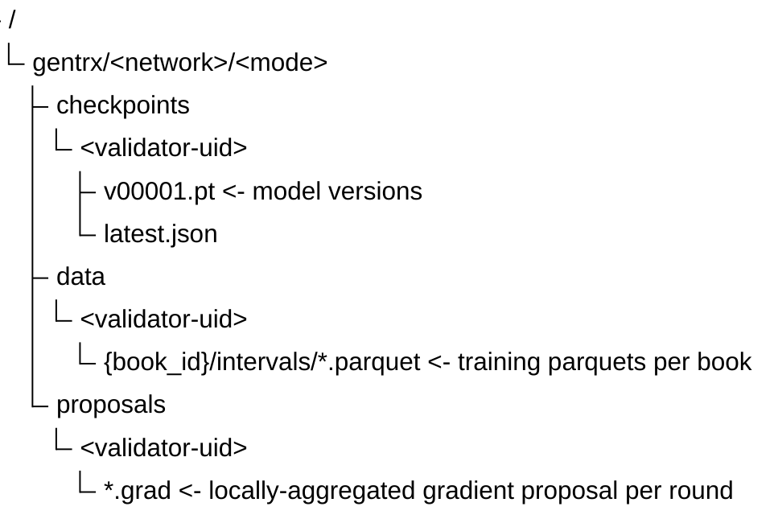

# GenTRX Validator Setup

Production validator setup with GenTRX distributed training enabled. Base MVTRX (SN-79) validator setup (chain endpoint, wallet, simulator) lives in the existing MVTRX (SN-79) validator docs; this guide only adds the GenTRX-specific configuration.

Two deployment shapes, same code path:

- **Same machine.** Both processes on one host. Loopback URL, no API key needed. The default and what most operators should use. Jump to [Option A: same machine](#option-a-same-machine-default).
- **Cross machine.** Gradient server on a GPU training host, validator on a separate host reaching it over the network. Requires an API key. Jump to [Option B: cross machine](#option-b-cross-machine).

---

## Quickstart: running a GenTRX validator

The simplest path is a single command - `run_validator.sh` handles bucket prompts, gradient server startup, and chain commitment on first run; subsequent updates require no input.

```bash
./run_validator.sh -G -w <coldkey> -h <hotkey> -u 79
```

**First run** - the script will:
1. Prompt for your R2/Hippius bucket credentials (write + read tokens); see [Bucket setup](#bucket-setup) below
2. Detect a local GPU and auto-start the gradient server, or guide you through connecting a remote GPU machine - printing a complete `run_gradients.sh` command with all credentials inline (no `.env` needed on the GPU host)
3. Look up your validator UID from the metagraph
4. Discover uid-0's aggregator bucket automatically from the chain commitment; only falls back to manual prompts if uid-0 has not yet committed
5. Save all configuration to `.env` and print the complete `run_validator.sh` command to reuse for updates

**Subsequent update runs** - no flags needed:
```bash
./run_validator.sh   # restores saved mode from .env, restarts everything, no prompts
```

**Changing the gradient server** - pass `-Q <url>` to override the saved address:
```bash
./run_validator.sh -Q http://new-gpu-host:8100/gentrx
```

**`run_validator.sh` flags relevant to GenTRX:**

| Flag | Description |
|------|-------------|
| `-G` | Enable GenTRX distributed training (sibling mode by default) |
| `-Q <url>` | Use an already-running gradient server at this URL; skip auto-start |

For the complete flag reference see the [README Run section](../../README.md#run-validator).

---

### Manual / advanced setup

If you prefer to manage processes individually (systemd, custom scripts), the sections below describe each step in detail. Read [Architecture](#architecture) first if you haven't already.

1. **[Role](#architecture).** You will run as a *sibling* validator (scores and proposes). To opt out of GenTRX entirely, omit `--gentrx.enabled`.
2. **[Bucket](#bucket-setup).** Create one R2 (or Hippius) bucket. Generate two API tokens on the bucket: write (private, stays on the host) + read (committed on-chain, public).
3. **[Env vars](#environment-variables).** Drop the `GENTRX_VALIDATOR_S3_*` keys into `.env`. Add `GENTRX_API_KEY` only if the gradient server is on a separate host.
4. **[Preflight](preflight.md).** Run `bin/gentrx_preflight --role validator …` and `--role gradient-server …` to verify deps, S3 reach, wallet registration, and the chain commitment.
5. **[Launch](#connecting-the-validator-to-the-gradient-server).** Start the gradient server, then the validator with `--gentrx.enabled --gentrx.gradient_server_url <url>`.

---

## Architecture

GenTRX maintains a **canonical model** updated each round by a designated aggregator (uid 0) operated by the MVTRX team. Validators (uid 1+) score miners independently, aggregate locally, and publish proposals to their own bucket; the aggregator evaluates all proposals and publishes the winning checkpoint. All validators commit their bucket to chain at startup, and miners discover buckets without pre-configuration (see [fallback](#bucket-setup)).

For the cross-validator proposal flow, see [`data_flow.md` § Multi-Validator Design](data_flow.md#multi-validator-design).

### Sibling validator (uid 1+, scores + proposes)

- Scores miners using own-data and held-out books (double scoring)
- Aggregates locally and publishes a proposal to own bucket (`proposals/<own-uid>/{round_id:08d}.grad`)
- Syncs model from uid-0's checkpoint each round to stay in lock-step
- Bootstraps from uid-0's checkpoint on first run (auto-discovered via chain)

### Non-training validator

- Optional: just runs base MVTRX (SN-79) validation (no GenTRX)
- Disable with `--gentrx.enabled` omitted or absent

---

## Bucket Setup

Each validator operates **one bucket** that holds checkpoints, training data (parquets), and aggregation proposals.

All keys live under `gentrx/<network>/<mode>/`:
- `<network>` is `mainnet` (when the gradient server runs against `--subtensor-network finney`) or `testnet` (anything else, including `test`, `local`, and custom WSS endpoints). Derived automatically; no flag.
- `<mode>` is selected with `--mode {simulation,exchange}` (default `simulation`). Today only `simulation` has a working data path; `exchange` reserves the prefix for future exchange-data training, leave it at the default.

A single bucket can hold both networks and both modes side by side under their respective prefixes. Per-miner gradient buckets are owned by miners. Validators never write to them.



**Writer**: Your gradient server (write creds never leave this host) **Reader**: All miners and sibling validators (via chain-committed read credentials) **Chain**: Read credentials committed on-chain at validator startup

**Important: uid-0 bootstrap responsibility.** The aggregator (uid 0) bucket is the canonical checkpoint source for the entire subnet. Miners and sibling validators pull checkpoints from it, discovered via chain commitment.

The chain commitment is the default discovery path. For robustness against chain propagation delays and transient RPC failures, the uid-0 operator **publishes read credentials** in a well-known location so other participants can pin them as a fallback.

Two env-var namespaces are in play here, and they are different because a sibling validator already uses `GENTRX_VALIDATOR_S3_*` for its own bucket:

| Env namespace | Points at | Set by |
|---|---|---|
| `GENTRX_VALIDATOR_S3_*` | **Your own** validator bucket. Writeable. | Every validator (aggregator and siblings). Miners do not set this. |
| `GENTRX_AGGREGATOR_S3_*` | **uid-0's** bucket. Read-only. Fallback used when chain discovery has not resolved yet. | Miners (always, as the env-var fallback). Sibling validators (optional). |

Sibling validator `.env` fallback block (uses uid-0's published read pair):

```bash
GENTRX_AGGREGATOR_S3_BUCKET=<uid-0-bucket>
GENTRX_AGGREGATOR_S3_ACCOUNT_ID=<uid-0-account-id>
GENTRX_AGGREGATOR_S3_READ_ACCESS_KEY=<uid-0-scoped-read-key>
GENTRX_AGGREGATOR_S3_READ_SECRET_KEY=<uid-0-scoped-read-secret>
```

The aggregator's own gradient server does not need these; it reads from and writes to its own bucket via `GENTRX_VALIDATOR_S3_*`.

Only the **read** pair is published. Write keys stay on the uid-0 host.

Canonical places for uid-0 to publish the read pair:
- Subnet's GitHub README (or a dedicated `SUBNET_BOOTSTRAP.md`)
- Subnet Discord pinned message
- Chain commitment from owner / sn-owner hotkey (alternative: write the same string via `btcli commit` so the chain also carries a known-good copy)

**Miner-side wiring is automatic.** `GenTRXAgent._get_aggregator_store_for_assignment` tries, in order: (1) `gtx_aggregator_uid` from `--agent.params` via chain commitment, (2) the miner's `GENTRX_AGGREGATOR_S3_*` env vars as a pinned fallback, (3) the assignment's `validator_uid` via chain commitment, (4) any other chain-committed validator bucket. The env-var fallback at step 2 covers the bootstrap window before the aggregator's chain commit propagates and remains a permanent backup if chain lookups ever fail.

**Credential rotation:** committed read creds go on-chain, so rotation requires a new chain commit. Plan your token lifetimes accordingly (30-day rotation is pragmatic; automate via a cron re-running `commit_bucket`).

---

## External setup: Cloudflare R2

R2 is the recommended production backend (S3-compatible API, no egress fees). Storj and Hippius are decentralised alternatives. Provider is auto-detected from the account_id slot of the on-chain commitment. MinIO works for local testing only.

### One-time R2 account setup

1. Create a Cloudflare account at https://dash.cloudflare.com.
2. Enable R2 (Storage > R2 > Sign up). You'll need to add a payment method.
3. Note your **R2 account ID** - a 32-char lowercase hex string visible in the R2 dashboard URL and "Manage R2 API Tokens" page. This derives the endpoint: `https://<account_id>.r2.cloudflarestorage.com`

### Per-deployment: create the bucket

In the R2 dashboard, create **one bucket** (e.g. `taos-gentrx-validator-prod`). Region: pick one close to where most miners run; egress is free anyway. The bucket stays private. Access is by API token only.

### Per-deployment: generate API tokens

R2 uses bucket-scoped tokens. You need two:

| Token | Permission | Used by |
|---|---|---|
| Read+Write | "Object Read & Write" on the bucket | Your gradient server (writes checkpoints, parquets, scores) |
| Read-only | "Object Read" on the bucket | All miners: committed on-chain, no manual distribution needed |

Generate via R2 > "Manage R2 API Tokens" > "Create API Token". For each token you get an **Access Key ID** and **Secret Access Key**.

You end up with **two token pairs**: write (stays on your host) and read (committed on-chain at startup, miners discover automatically).

### Map credentials to env vars

Put both token pairs into your validator/gradient-server `.env`:

```bash
# --- Validator bucket ---
GENTRX_VALIDATOR_S3_BUCKET=taos-gentrx-validator-prod
GENTRX_VALIDATOR_S3_ACCOUNT_ID=<32-char-r2-account-id>
GENTRX_VALIDATOR_S3_WRITE_ACCESS_KEY=<RW-access-key>
GENTRX_VALIDATOR_S3_WRITE_SECRET_KEY=<RW-secret>
GENTRX_VALIDATOR_S3_READ_ACCESS_KEY=<RO-access-key>
GENTRX_VALIDATOR_S3_READ_SECRET_KEY=<RO-secret>
```

The read credentials are committed on-chain automatically when the validator starts with `--gentrx.enabled`. Miners and the aggregator discover the bucket from the chain - no manual credential distribution needed.

### Quick verification

After the env vars are loaded, confirm R2 is reachable:

```bash
venv/simulator/bin/python -c "
from GenTRX.src.gradient_store import create_validator_store_from_env
store = create_validator_store_from_env(mode='write')
print('validator bucket:', store.endpoint_url, store.bucket)
"
```

If the line prints without error, the gradient server can authenticate.

### Storj alternative

Storj is a decentralised S3 implementation. Endpoint is `https://gateway.storjshare.io` (static), region `global`. Access keys are 28 chars and secrets are 53 chars (base32, fixed by the gateway).

Setup pattern: create one bucket via the Storj UI, generate two S3 access keys (write grant with full bucket scope, read grant with GetObject scope only). ListBucket is not required for the validator read flow because gradient keys are deterministic. Set `GENTRX_VALIDATOR_S3_PROVIDER=storj` and `GENTRX_VALIDATOR_S3_BUCKET=<name>`. The bucket name is stored on-chain with a `storj:` prefix in the account_id slot, so the validator can route to the right endpoint without further config.

### Hippius alternative

Hippius is a decentralised S3 implementation. Endpoint is `https://s3.hippius.com` (static), region `decentralized`. Provider is auto-detected when the account_id slot is a non-hex bucket name without the `storj:` prefix.

Setup pattern is the same as R2: create one bucket, generate read+write tokens. Omit `GENTRX_VALIDATOR_S3_ACCOUNT_ID`; the bucket name is stored in the account_id field on-chain.

### Self-hosted MinIO (localnet only)

MinIO works as a drop-in S3 server for local testing - it's what `agents/proxy/setup_minio` spins up. For production, MinIO is **not recommended**: on-chain commitments encode only the account_id, and self-hosted MinIO requires the operator to expose a stable public endpoint. The localnet path bridges this with `GENTRX_CHAIN_ENDPOINT_OVERRIDE`, but this override would have to be agreed on across all participants in production - it doesn't scale.

---

## Environment Variables

```bash
# --- Validator bucket (checkpoints + data + scores) ---
GENTRX_VALIDATOR_S3_PROVIDER=r2                         # r2 | storj | hippius
GENTRX_VALIDATOR_S3_BUCKET=<bucket-name>
GENTRX_VALIDATOR_S3_ACCOUNT_ID=<R2-account-id>          # R2 only
GENTRX_VALIDATOR_S3_WRITE_ACCESS_KEY=<write-key>        # gradient server only
GENTRX_VALIDATOR_S3_WRITE_SECRET_KEY=<write-secret>
GENTRX_VALIDATOR_S3_READ_ACCESS_KEY=<read-only-key>     # committed on-chain
GENTRX_VALIDATOR_S3_READ_SECRET_KEY=<read-only-secret>

# --- Chain endpoint override (MinIO localnet only - leave empty for R2/Hippius) ---
# Required when on-chain commitments contain only an account_id and the
# corresponding S3 endpoint is not derivable (e.g. a self-hosted MinIO).
# GENTRX_CHAIN_ENDPOINT_OVERRIDE=http://localhost:9000

# --- Validator <> gradient server auth ---
# Both validator and gradient server must share this. Required when binding
# the gradient server to a non-loopback address.
# GENTRX_API_KEY=<long-random-string>
```

---

## Connecting the validator to the gradient server

The validator and gradient server are always separate processes that talk HTTP. Two supported topologies:

1. **Same machine** (recommended for most deployments) - both processes on one host, loopback URL, no auth needed. Five-minute setup.
2. **Cross machine** - gradient server on a dedicated training host, validator reaches it over the network with a shared API key. Same code path; you only add `--bind` and `--api-key`.

Endpoints used (payload schemas and the round-lifecycle sequence live in [`data_flow.md`](data_flow.md)):

| Direction | Endpoint | Purpose |
|---|---|---|
| Validator → Server | `POST /gentrx/state` | per-tick msgpack state push |
| Validator → Server | `GET /gentrx/data-status` | parquet readiness poll before opening a round |
| Validator → Server | `POST /gentrx/round` | close current round, install next round's assignments |
| Validator → Server | `GET /gentrx/scores?since_round=N` | pull fresh scores |
| Validator → Server | `GET /gentrx/version` | check model-version bumps |

The validator never writes to S3 directly - the gradient server owns all bucket I/O. The validator's only inputs to the gradient server are over these endpoints.

### Option A: same machine (default)

Both processes on one host. The gradient server binds `127.0.0.1` by default, so no API key is required.

The easiest path is a single command that handles everything:

```bash
./run_validator.sh -G
```

To manage the gradient server independently (e.g. to restart it without restarting the validator):

```bash
# Start / restart the gradient server only
./run_gradients.sh -G

# Then run the validator pointing at the already-running server
./run_validator.sh -Q http://127.0.0.1:8100/gentrx
```

Both scripts prompt for credentials on first run and save everything to `.env`. No flags are needed on subsequent runs.

**Manual launch** (if you manage processes outside pm2):

```bash
# Gradient server
python -m GenTRX.src.gradient_server \
    --checkpoint checkpoints/GenTRX/best.pt \
    --val-data data/gentrx_val \
    --output checkpoints/GenTRX/latest.pt \
    --port 8100 \
    --subtensor-network <endpoint> \
    --netuid 79 \
    --mode simulation \
    --no-is-aggregator

# Validator (separate process)
cd taos/im/neurons && python validator.py \
    --netuid 79 --subtensor.chain_endpoint <endpoint> \
    --wallet.name <coldkey> --wallet.hotkey <hotkey> \
    --simulation.xml_config /path/to/simulation.xml \
    --gentrx.enabled \
    --gentrx.gradient_server_url http://127.0.0.1:8100/gentrx
```

**Verify:**
```bash
curl -sS http://127.0.0.1:8100/gentrx/version
# → {"version": 0}  (increments after each successful aggregation)
```

### Option B: cross machine

Gradient server on a GPU training host, validator on a separate host.

**On the GPU machine.** Copy `run_gradients.sh` and run it. The first-run wizard generates an API key, prompts for S3 credentials, and saves everything to `.env`. Subsequent runs skip all prompts.

```bash
scp run_gradients.sh gpu-host:/path/to/
ssh gpu-host
./run_gradients.sh -G -b 0.0.0.0 -e <subtensor-endpoint> -u 79
```

`run_gradients.sh` generates the API key automatically (or lets you enter an existing one) and prints the key for you to copy to the validator host. It also opens a `gentrx` tmux session with htop, GPU monitor, and gradient server logs.

**On the validator host.** Point `run_validator.sh` at the GPU machine. If credentials are already in `.env` (from a prior run), no flags are needed beyond `-Q`:

```bash
./run_validator.sh -Q http://<gpu-host>:8100/gentrx
```

On first run it will prompt for the API key and any missing S3 credentials and save them to `.env`.

Alternatively, when first setting up with `run_validator.sh -G`, the script detects no local GPU, prompts for the GPU host address, and prints a complete `run_gradients.sh` command with all credentials inline. No `.env` is needed on the GPU host.

**Verify auth from the validator host:**
```bash
# No key → 401
curl -sS -w "\n%{http_code}\n" http://<gpu-host>:8100/gentrx/version

# With key → 200
curl -sS -H "X-API-Key: $GENTRX_API_KEY" http://<gpu-host>:8100/gentrx/version
# → {"version": 0}
```

**Manual launch** (if not using the run scripts):
```bash
# On the GPU machine
python -m GenTRX.src.gradient_server \
    --checkpoint checkpoints/GenTRX/best.pt \
    --val-data data/gentrx_val \
    --output checkpoints/GenTRX/latest.pt \
    --port 8100 --bind 0.0.0.0 \
    --api-key "$GENTRX_API_KEY" \
    --subtensor-network <endpoint> --netuid 79 --mode simulation --no-is-aggregator

# On the validator host
python validator.py ...base flags... \
    --gentrx.enabled \
    --gentrx.gradient_server_url http://<gpu-host>:8100/gentrx \
    --gentrx.api_key "$GENTRX_API_KEY"
```

#### vast.ai

A worked example of Option B on a rented vast.ai GPU instance, using direct port mapping. For a stable hostname that survives instance restarts (no re-pointing the validator), use a Cloudflare Tunnel from inside the instance instead and follow [`operations.md` § Cloudflare Tunnel](operations.md#option-1-cloudflare-tunnel-cloudflared-recommended-for-most-operators).

**Instance template.** When creating the vast.ai instance:

1. Pick a generic CUDA image, for example `pytorch/pytorch:2.x-cuda12.x-cudnn-runtime`.
2. In the port-forwarding section, declare TCP port 8100. Vast.ai publishes it to a random public port and exposes the public port as `VAST_TCP_PORT_8100` inside the container.
3. Mount a persistent disk at `/workspace` so `.env`, val data, and any cached checkpoint survive instance restart. Without it, the gradient server rebootstraps from S3 on every cold boot.
4. Filter for RTX 3090 / 4090 / A4000 class or better with > 95% reliability. The model is small (~12M params); inbound bandwidth and uptime matter more than VRAM.

**On the vast.ai instance.** SSH in, clone the repo onto the persistent disk, and run the wrapper:

```bash
ssh vast-instance
git clone https://github.com/taos-im/sn-79 /workspace/sn-79 && cd /workspace/sn-79
./run_vast.sh -G -V <validator-uid> -e <subtensor-endpoint> -u 79
```

`run_vast.sh` wraps `run_gradients.sh` with vast.ai-specific defaults: it forces `-b 0.0.0.0` (so the public port mapping reaches the server), suppresses tmux (so the SSH session can detach), and prints the public URL plus the generated API key once everything is up.

**On the validator host.** Copy the printed URL and API key into `run_validator.sh`:

```bash
./run_validator.sh -Q http://<public-ip>:<public-port>/gentrx
# First run prompts for the API key; saved to .env afterwards.
```

**Instance restart.** Vast.ai assigns a new public IP and port when an instance is re-provisioned. Re-run `run_vast.sh` on the GPU host, copy the new URL, and re-point the validator with `-Q`. The API key is preserved if `/workspace/sn-79/.env` is on persistent disk; otherwise a new one is generated.

**Credentials hygiene.** The host operator can in principle read disk on their machine. Use a dedicated R2 or Hippius write token scoped to the validator bucket and rotate it when retiring the instance. The on-chain read token does not change.

Recommended network hardening beyond the API key:

- **Restrict the bind** - `--bind <private-IP>` and a firewall rule that only allows the validator host to reach port 8100. The key protects confidentiality + integrity; the firewall removes the attack surface.
- **Encrypt the channel** - keep the gradient server bound to loopback and use one of the options in [`operations.md` TLS termination](operations.md#tls-termination). Cloudflare Tunnel (`cloudflared`) is the simplest: no port forwarding, no certificate management, and fits naturally with R2.
- **Rotate keys** - change the secret on both hosts simultaneously; no state is tied to the old one.

### Validator bootstrapping (both topologies)

The validator does not need any S3 credentials directly - the gradient server owns bucket I/O. But the validator-side bucket read creds **are** committed on-chain at startup so miners can pull checkpoints without pre-config, so `GENTRX_VALIDATOR_S3_READ_*` env vars are required on the validator host regardless of topology.

Sibling validators bootstrap from uid-0's checkpoint on first run (discovered via chain), then score independently. No local checkpoint needed at first boot.

## Request flow (what happens per round)

1. Validator's `GenTRXService.push_state(state)` extracts each tick into a msgpack dict and POSTs it to `/gentrx/state`.
2. Gradient server processes ticks in-memory, replays events through the `MatchingEngine`, accumulates rows per book, and flushes parquets to the validator bucket every `parquet_interval_ns` of sim time.
3. Background thread:
   - Reads gradients from per-miner buckets (discovered via chain commitments)
   - Double scoring: `score_own` (miner's assigned data) + `score_held` (held-out validation books)
   - Overfitting detection: penalises when `score_own > score_held * 3.0`
   - Aggregates accepted gradients locally and publishes a proposal to `proposals/<own-uid>/{round_id:08d}.grad` in its own bucket
   - **Aggregator only**: reads proposals from every validator bucket and picks the best delta (highest held-out score) to publish as the canonical checkpoint
4. Validator creates assignments and pushes them to the gradient server via `POST /gentrx/round`, then delivers to miners via dendrite. Each assignment carries `model_version`, data bucket credentials, and `validator_uid` so miners can discover everything from the assignment. The validator checks data readiness via `GET /gentrx/data-status` before initiating a round.
5. Validator polls `GET /gentrx/scores` and exposes scores to weight computation.
6. **Proposals (aggregation-of-aggregations)**: all validators aggregate locally and publish `proposals/<own-uid>/{round_id:08d}.grad` to their own bucket. The aggregator (uid 0) evaluates proposals from all validators and picks the best delta to apply to the model.
7. **Model sync**: sibling validators sync the model from uid-0's bucket each round. Miners always get checkpoints from uid-0.

### What the gradient server itself needs

- Validator bucket WRITE creds (publish checkpoints + parquets + proposals)
- Subtensor endpoint + netuid (read miner and sibling-validator bucket commitments)
- Optional `--api-key` / `GENTRX_API_KEY` - only required when `--bind` is non-loopback

Books are discovered from incoming state ticks (and from the validator bucket on restart) - no book count parameter needed.

### Bucket traffic profile

Per-day request and storage volumes for each bucket role (aggregator, sibling, miner) live in [`traffic.md`](traffic.md). Use those to size your storage provider's budget, set rate-limit thresholds, and pick sensible billing alarms.

### Cold storage (recommended)

`--keep-checkpoints` and `--keep-proposals` (defaults 10/10) bound hot-bucket size. The `data/` prefix is auto-wiped on sim end (ESE marker) so it stays bounded too. For a long-term lineage of checkpoints (audit trail, post-incident analysis, retraining from a specific historical state) mirror them to cold storage on your own schedule. A nightly `aws s3 sync`, `rclone copy`, or `mc mirror` of `checkpoints/` to B2 / Glacier / a local NAS is the usual pattern; all three speak R2 / Hippius. There is no bundled archival path because retention policies vary. The volume tables in [`traffic.md`](traffic.md) only cover the hot bucket.

### Operational guardrails

Hot-bucket size is bounded by `--keep-checkpoints` / `--keep-proposals` (defaults 10/10) and by the auto-wipe of `data/` on every sim-end marker. `--max-gradient-bytes` (default 10 MB) caps any single upload from a miner. Miner gradient uploads back off exponentially (30 s to 300 s) on failure, so a transient outage does not become a retry storm. Write credentials are separate from the on-chain read pair and never leave the gradient server host.

Read credentials committed on-chain are public by design: peers need them to pull gradients and checkpoints. The operator-side controls that follow are observational and reactive rather than preventive:

- Watch the per-bucket request and storage curves against the baseline in [`traffic.md`](traffic.md#monitoring-recommended). Material drift without a participant-count change is the cue to look at provider-side rate limiting (a reverse-proxy or WAF rule on the bucket endpoint).
- Provider billing alarms above the steady-state baseline give an earlier signal than the invoice.
- The on-chain commitment is static; rotate read tokens manually on whatever schedule fits your operator policy. Quarterly is a reasonable default.

The gradient server's collect path runs sequentially today, which keeps the local boto3 client pool predictable. If collection moves to a concurrent fan-out at higher miner counts, Templar's `client_semaphore` + `upload_sem` pattern in `templar/src/tplr/comms.py` is the shape for capping the local pool (a self-throttle, not an access control).

### Checkpoint access fallback

If uid-0 has not yet committed its bucket on-chain, miners and sibling validators fall back to `GENTRX_AGGREGATOR_S3_*` env vars for the canonical checkpoint source. Once uid-0 commits, the chain path takes over automatically.

---

## Tunables

### Gradient server (CLI)

| Flag | Default | Notes |
|---|---|---|
| `--min-score` | -0.1 | Reject gradients with score below this |
| `--warmup-rounds` | 5 | Skip rejection during initial rounds |
| `--max-val-batches` | 10 | Held-out val batches per miner; higher = less score noise, more GPU time |
| `--books-per-miner` | 3 | Books per assignment |
| `--val-fraction` | 0.10 | Fraction of books reserved for validation |
| `--parquet-interval-ns` | 5min sim time | One parquet per N sim seconds |
| `--loop-sleep-s` | 5s | Background loop poll interval |
| `--blocks-per-round` | 25 | Server-side estimate, used only by the heartbeat-loss fallback. Should match the validator's `--gentrx.blocks_per_round`. |
| `--block-time-s` | 12.0 | Assumed seconds per block on the target chain. Combined with `--blocks-per-round` to estimate round duration for the fallback. |
| `--round-grace-s` | 30s | Grace seconds added to the heartbeat-loss fallback estimate before force-closing a round. Only fires if the validator stops pushing `POST /gentrx/round`. |
| `--max-gradient-bytes` | 10 MB | Reject oversized gradients |
| `--keep-checkpoints` | 10 | Hot-bucket retention. Older `checkpoints/v*.pt` deleted after each successful publish; `latest.json` is preserved. Set `0` to disable pruning - recommended only if you mirror checkpoints to cold storage. |
| `--keep-proposals` | 10 | Hot-bucket retention for `proposals/<own-uid>/{round_id:08d}.grad`. Set `0` to disable. |
| `--window-ns` | 5min sim time | Training window per assignment |
| `--no-is-aggregator` | (on) | Sibling mode: score + propose only |
| `--wandb-project` | (empty) | Enable wandb dashboard - see [`wandb.md`](wandb.md) |

### Validator (CLI)

| Flag | Default | Notes |
|---|---|---|
| `--gentrx.enabled` | (off) | Master switch |
| `--gentrx.gradient_server_url` | (empty) | Required when enabled. Use `http://127.0.0.1:8100/gentrx` for single-machine setups. |
| `--gentrx.api_key` | (empty) | Shared secret for validator<>gradient server auth (also `GENTRX_API_KEY` env) |
| `--gentrx.interval` | 30s | Service poll interval (assignment fetch + score poll) |
| `--gentrx.blocks_per_round` | 25 | Block-synced cadence: validator drives `round = block // N` and pushes POST /round to the gradient server. ~5min at 12s/block. Pass 0 for timer mode (proxy test only) |

---

## Monitoring

```bash
# Service activity (assignment delivery, scores received, etc.)
# GenTRX records flow through bt.logging with a [GTX] prefix -
# tail whatever you use for validator stdout (pm2 logs, systemd journal,
# a plain tee, …) and grep:
pm2 logs validator | grep "\[GTX\]"

# Aggregation events (JSONL)
cat checkpoints/aggregation.jsonl | python3 -m json.tool
```

To verify checkpoints are being published, watch your bucket on the Cloudflare R2 dashboard (or Hippius UI). For a terminal check the project's existing boto3 dependency does it without any AWS CLI install:

```bash
venv/simulator/bin/python - <<'PY'
import os, boto3
acct = os.environ["GENTRX_VALIDATOR_S3_BUCKET"]
s3 = boto3.client(
    "s3",
    endpoint_url=f"https://{os.environ.get('GENTRX_VALIDATOR_S3_ACCOUNT_ID', acct)}.r2.cloudflarestorage.com",
    aws_access_key_id=os.environ["GENTRX_VALIDATOR_S3_WRITE_ACCESS_KEY"],
    aws_secret_access_key=os.environ["GENTRX_VALIDATOR_S3_WRITE_SECRET_KEY"],
    region_name=os.environ.get("GENTRX_VALIDATOR_S3_REGION", "auto"),
)
resp = s3.list_objects_v2(Bucket=acct, Prefix="checkpoints/")
for obj in resp.get("Contents", []):
    print(f"{obj['Key']:<40} {obj['Size']:>10} bytes")
PY
```

All GenTRX records carry the `[GTX]` prefix (baked in by `gtx_log`, never relies on a separate log file), so a single grep against the validator stream isolates them.

---

## Hardware Recommendations

The gradient server hosts the model and runs gradient scoring (forward passes on val data); the validator is a thin HTTP client. They can run on the same host (loopback) or different hosts.

- **Gradient server host** - GPU + 32GB RAM + 100GB disk. NVIDIA, 16GB+ VRAM recommended; CPU works but scoring is significantly slower.
- **Validator host** (when separate) - no extra requirements.

---

## Troubleshooting

| Problem | Likely cause | Fix |
|---|---|---|
| `from_config returned None` at startup | `--gentrx.enabled` not set, OR `--gentrx.gradient_server_url` empty | Add both to your launch command |
| `Initial checkpoint uploaded` not seen on gradient server | Validator bucket not configured | Verify `GENTRX_VALIDATOR_S3_WRITE_*` env vars |
| Miners receive assignments but never submit gradients | Miner training failures, or gradient server can't read miner buckets | Check miner logs, verify chain commitments via `btcli commit show` |
| `state POST failed: 401` | API key mismatch, OR validator thinks there's no key and server requires one (or vice versa) | `curl -H "X-API-Key: $GENTRX_API_KEY" http://<host>:8100/gentrx/version` from the validator host to narrow it down. Ensure `GENTRX_API_KEY` is set (or unset) on **both** sides consistently |
| `state POST failed: Connection refused` | Gradient server not running, wrong port, or firewall | Check `curl http://<host>:8100/gentrx/version` from the validator host. For same-machine setups the URL must be `127.0.0.1`, not `0.0.0.0` |
| Scores never appear | Wrong `--gentrx.gradient_server_url` | URL must end in `/gentrx` (no trailing slash). Check with `curl .../gentrx/version` |
| Gradient server takes too long, missing rounds | Too much val data, slow GPU | Reduce `--max-val-batches`, increase `--interval` |
| Validator bucket commit failed | Missing `GENTRX_VALIDATOR_S3_READ_*` env vars | Set read credentials for on-chain commitment |
| Sibling validator has no checkpoint at startup | uid-0 not reachable or has no bucket commitment | Ensure uid-0 is running and committed; or provide a local `--checkpoint` |
| Stale parquets after sim restart | Old `data/` from a previous sim run | Handled automatically: the gradient server detects the `ESE` (end-of-sim) marker in state ticks and wipes `data/` in the validator bucket before the new sim starts. No operator action needed. If cleanup appears to have been missed, restart the gradient server; it will re-detect the new sim on the first state push. |
